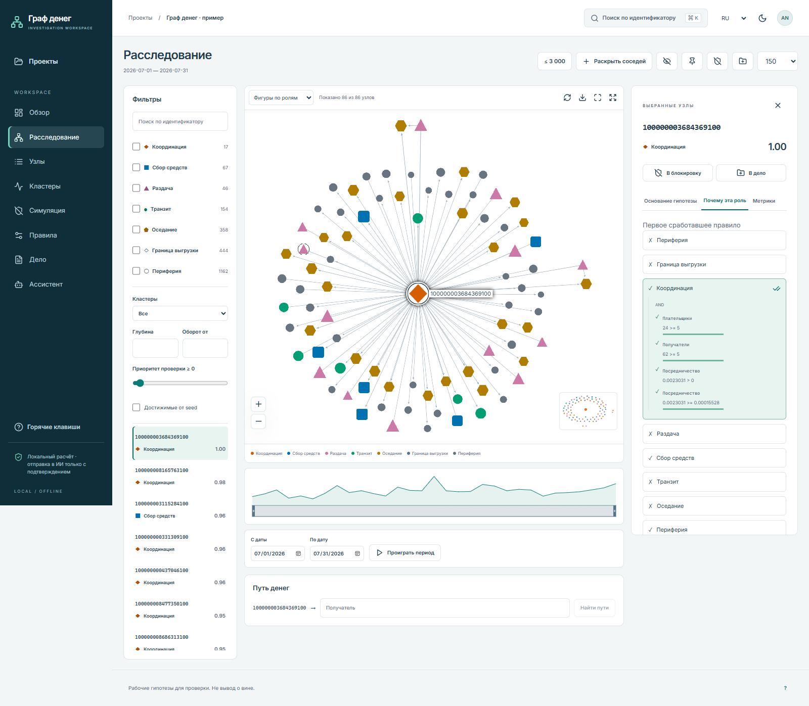
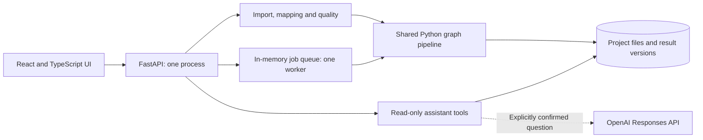

# Money Graph

[Русский](README.md) · **English** · [Қазақша](README.kk.md)

**Turn transaction files into an explainable investigation workspace.** Money Graph imports CSV, Parquet and XLSX, checks data quality, assigns rule-based roles, ranks accounts for review and lets an analyst explore the evidence behind each result.

This is a local, single-analyst MVP. Scores and roles are investigation hypotheses, not findings of guilt. The current application has **no user authentication or account-level isolation**. Docker publishes it on your own computer's loopback interface by default.



## Contents

- [What you can do](#what-you-can-do)
- [Start with Docker](#start-with-docker)
- [Your first investigation](#your-first-investigation)
- [Configure the AI assistant](#configure-the-ai-assistant)
- [Data and configuration](#data-and-configuration)
- [Architecture](#architecture)
- [Update, stop and back up](#update-stop-and-back-up)
- [Run without Docker](#run-without-docker)
- [Development and checks](#development-and-checks)
- [Troubleshooting](#troubleshooting)
- [Model and deployment boundaries](#model-and-deployment-boundaries)
- [Documentation and contributing](#documentation-and-contributing)

## What you can do

- Import transaction files, review suggested column mappings and confirm the meaning of each field before analysis.
- Inspect data quality, missing dates, seed coverage, connected components and collection boundaries.
- Explore account roles, priority scores, clusters, rule traces and a directed graph with filters and a timeline.
- Compare node-removal scenarios with random selections, inspect paths and export selected rows or complete results.
- Save analyst cases and generate an HTML dossier that can be printed to PDF.
- Use four local assistant actions, or explicitly send a question to OpenAI after configuring an API key.
- Work in Russian, English or Kazakh, with light and dark interface themes.

## Start with Docker

### Prerequisites

- Git and a running Docker Engine with **Docker Compose 2.24.0 or newer**.
- On Windows and macOS, use Docker Desktop. On Windows, select **Linux containers** and ensure its virtualization/WSL backend is available.
- Internet access for the first build: base images, Python packages and npm packages must be downloaded. Local analysis works without internet after installation; OpenAI questions still require an internet connection.

You do not need Python or Node.js installed on the host for this route.

Run from a terminal:

```sh
git clone https://github.com/BAITC-Hacks/hack-61c5ca4c-orbit-digital-ako.git
cd hack-61c5ca4c-orbit-digital-ako
docker compose up --build -d
docker compose ps
```

Open **[http://127.0.0.1:8000](http://127.0.0.1:8000)**. There is no login step in the current version. Choose **Open example** or create a new analysis.

- API explorer: [http://127.0.0.1:8000/api/docs](http://127.0.0.1:8000/api/docs).
- Health endpoint: [http://127.0.0.1:8000/api/health](http://127.0.0.1:8000/api/health).
- Logs: `docker compose logs --tail=100 app`.

The build compiles the React frontend from its source and npm lockfile, installs the Python backend and OpenAI SDK, and starts one application process. An API key is optional: no key is needed to start the application or use local assistant actions.

### If port 8000 is occupied

PowerShell:

```powershell
$env:MONEYGRAPH_PORT = '8080'
docker compose up --build -d
```

macOS/Linux:

```sh
MONEYGRAPH_PORT=8080 docker compose up --build -d
```

Then open `http://127.0.0.1:8080`. The container still listens on port 8000. Keep the same port setting when running subsequent Compose commands.

## Your first investigation

1. Select **Open example** to copy the bundled hackathon dataset into a new project and start an analysis.
2. Wait for the analysis to finish. Review the overview and data-quality findings first.
3. Open the investigation view and select an account. Read its metrics and the rule trace before interpreting its role.
4. Inspect its incoming and outgoing links, compare related accounts, or run a node-removal scenario.
5. Add relevant accounts to an analyst case, record your reasoning, then export or print the dossier.

For your own data, choose **New analysis** and follow **files → columns → parameters → quality → calculation**. Column suggestions do not run an analysis until you confirm them.

## Configure the AI assistant

The assistant explains computed results; it does not change transactions, roles or scores. The local actions are **Explain**, **Common recipients**, **Path** and **Missing data**. They require no OpenAI account.

For natural-language questions, create `money_graph/.env` from the supplied template **only if the file does not already exist**.

PowerShell:

```powershell
if (-not (Test-Path money_graph/.env)) {
    Copy-Item money_graph/.env.example money_graph/.env
}
```

macOS/Linux:

```sh
test -f money_graph/.env || cp money_graph/.env.example money_graph/.env
```

Edit the file locally:

```dotenv
OPENAI_API_KEY=<your-project-api-key>
OPENAI_MODEL=gpt-4.1-mini
```

Apply the changed environment:

```sh
docker compose up -d --force-recreate app
```

Select one to five accounts, enter a question such as **“Why should this account be reviewed first? Cite the available evidence.”**, and confirm external data transfer for that request. A path action requires exactly two accounts; selection order determines direction.

The API key is supplied to the backend at runtime. It is excluded from Git and the Docker build context. Do not put secrets into `web/src`, a `VITE_*` variable, a Docker build argument or an image layer. Another machine needs its own runtime configuration after cloning; Git does not transfer your local `.env`.

“Configured” means the key and SDK are present, not that provider access or billing has been verified. The API adapter requires `allow_external: true` for each model question. Provider requests can incur charges; local graph actions remain available when the provider fails.

See [the deployment and external API contract](money_graph/docs/INTEGRATIONS.md) for request/response examples, outbound access, limits and error handling.

## Data and configuration

### Supported input

- **CSV:** UTF-8, UTF-8 BOM or Windows-1251; comma, semicolon, tab or pipe delimiters.
- **Parquet:** typed columnar data.
- **XLSX:** select a worksheet; the application does not execute formulas or macros.

At least one transaction or aggregated-edge table is required. Files can use different column names: map them to the canonical fields in the import wizard.

- **Transactions:** `src`, `dst`, `amount`; `date` is optional. Without usable dates, temporal metrics are disabled; partially dated data is analyzed with the available dates and quality findings.
- **Aggregated edges:** `src`, `dst`, `amount`, with optional `n_tx` (defaults to 1). When transactions are supplied, edges are rebuilt from them.
- **Nodes, optional:** `id`, with optional `depth` and `is_seed`.
- **Seeds, optional:** an `id` column, a node flag, or a manually entered list.

Identifiers remain strings in the API and browser, preserving leading zeros and large account identifiers. Set the currency, collection threshold, known collection depth and evidence language explicitly. A depth inferred from the graph is not proof of the data-collection boundary.

The default upload limit is 20 files per project, up to 500 MB per file. This is an admission limit, not a memory or processing-time guarantee. More than 5% of rows missing required source/destination/amount values block analysis. Smaller invalid fractions and nonpositive amounts are excluded with findings; identical transaction rows are retained for analyst review.

### Configuration locations

- `money_graph/config.json`: default rule thresholds, priority weights, sampling, iteration count and upload limit. New projects copy these settings; changing the file does not rewrite existing projects.
- `money_graph/.env`: optional private OpenAI runtime settings.
- `MONEYGRAPH_PORT`: Compose host port, default `8000`; set in your shell or the root Compose environment, not the application's nested `.env`.
- `MONEY_GRAPH_PROJECTS`: backend project-storage path. Compose sets `/data/projects`; native runs default to `money_graph/projects/`.
- `OPENAI_API_KEY`: optional server-side provider credential.
- `OPENAI_MODEL`: defaults to `gpt-4.1-mini`; choose a model available to your API project that supports the application's tool and structured-output usage.

The host's `money_graph/projects/` and the Docker volume are separate stores. Merely cloning the repository or changing the runtime does not copy existing investigations.

## Architecture



- **Frontend:** React, TypeScript and Vite; Sigma.js/graphology for the graph, TanStack tools for tables and queries, Recharts for charts, i18next for localization.
- **Backend:** FastAPI/Uvicorn with the same origin for the UI and API. Swagger assets and fonts are served locally.
- **Analysis:** pandas, NumPy, NetworkX and scikit-learn. CLI and web analysis share `mg.pipeline.run_pipeline`.
- **Storage:** files, JSON and Parquet under the project directory. No database server or Redis is required.
- **Execution:** a single-process background queue. Completed results are stored; active jobs are not durable across a process restart.

```text
compose.yaml                 Local container deployment
Dockerfile                   Frontend build and Python runtime
README.md / README.en.md / README.kk.md
money_graph/
  api/                       Project API, storage and background jobs
  mg/                        Import, quality, analysis and assistant tools
  web/src/                   React application source
  web/dist/                  Bundled frontend for native use
  data/                      Bundled demonstration input
  out/                       CLI baseline outputs
  projects/                  Native user data; ignored by Git
  config.json                Default analysis parameters
  serve.py                   Native server entry point
  run.py / check.py          Baseline CLI analysis and validation
  docs/                      Method, API integration and historical QA
  tests/                     Universal pipeline and API checks
tests/                       Baseline and assistant checks
```

## Update, stop and back up

Update a clone with no conflicting local source changes:

```sh
git pull --ff-only
docker compose up --build -d
```

Finish active analyses before recreating the service. The `moneygraph_data` named volume retains uploaded files, normalized datasets, completed results, notes and cases. Its actual Docker name may include the Compose project prefix. Keep the same Compose project name to reuse it.

- Stop temporarily: `docker compose stop`.
- Start again: `docker compose start`.
- Remove the container/network while keeping data: `docker compose down`.
- **`docker compose down -v` deletes the volume and its investigations.** It is not an update command.

For a consistent backup, stop the application before copying data. In PowerShell:

```powershell
New-Item -ItemType Directory -Force backups | Out-Null
docker compose stop app
docker compose cp app:/data/projects ./backups/projects
docker compose start app
```

On macOS/Linux, replace the first line with `mkdir -p backups`. Use a fresh destination for each backup. Store backups securely and separately from your API key. See [deployment operations](money_graph/docs/DEPLOYMENT.md) for restoration and migration between native and container storage.

## Run without Docker

Use Python **3.12** for a setup matching the container. The current source requires Python 3.10 or newer. Prebuilt `web/dist/` is included, so Node.js is unnecessary unless you change the frontend.

From the repository root, Windows PowerShell:

```powershell
python -m venv .venv
.\.venv\Scripts\python.exe -m pip install -r money_graph/requirements-ai.txt
.\.venv\Scripts\python.exe money_graph/serve.py
```

macOS/Linux:

```sh
python3 -m venv .venv
.venv/bin/python -m pip install -r money_graph/requirements-ai.txt
.venv/bin/python money_graph/serve.py
```

For local analysis without the OpenAI SDK, install `money_graph/requirements.txt` instead. Both routes open `http://127.0.0.1:8000`. Native and Docker servers cannot share the same host port at the same time.

## Development and checks

Activate your virtual environment before these Python commands. Commands run from the repository root unless a directory change is shown.

```sh
python -m pip install -r money_graph/requirements-dev.txt
python -m pip install -r money_graph/requirements-ai.txt
python -m pytest -q tests money_graph/tests
```

Tests use fixtures and provider mocks; they do not need a paid OpenAI request. Integration tests create temporary projects.

Frontend development requires Node.js 20.19+ or 22.12+; the Docker builder uses Node.js 22:

```sh
cd money_graph/web
npm ci
npm run dev
```

Run the Python server in a second terminal. Vite proxies `/api` to `127.0.0.1:8000`. `npm run build` runs TypeScript checks and creates the production frontend. After editing the UI, rebuild `web/dist/` before a native release; Docker rebuilds it from source.

Browser tests, from `money_graph/web/`:

```sh
python ../tools/make_synthetic.py --out ../.local/synthetic
npx playwright install chromium
npm run test:e2e
```

The test runner starts the native backend on port 8000, or reuses one already running outside CI. To test an existing Docker server, set `PLAYWRIGHT_BASE_URL` to its address (for example, `http://127.0.0.1:18000`); this disables automatic backend startup. Chromium is the default browser; `PLAYWRIGHT_BROWSER` optionally selects another installed browser by absolute executable path. Browser installation requires network access and, on Linux, the system libraries Playwright needs. Screenshots are written to ignored test artifacts rather than overwriting documentation images.

For the original hackathon export contract, from `money_graph/`:

```sh
python run.py
python check.py
```

`check.py` validates the bundled 2,248-node input and its required output schema. It is not a validator for arbitrary user datasets or proof of model accuracy.

CSV exports restrict `role` to the six specification values: `consolidator`, `transit`, `distributor`, `terminal`, `coordinator` and `peripheral`. A node cut off at the collection boundary is exported as `role=peripheral`, `role_detail=truncated`, `is_truncated=True`, with `role_base=role`. This mapping satisfies the export vocabulary; it does not reclassify the node's behavior. All 444 boundary nodes in the baseline remain present, and the analytical graph, Parquet results and priority calculation continue to distinguish `truncated`. The same contract applies to CLI exports, selected-row CSV, individual CSV and ZIP downloads, including downloads of older cached results.

## Troubleshooting

- **Docker cannot connect:** start Docker Desktop/Engine and verify `docker version`. Use Linux containers.
- **Compose rejects `env_file.required`:** upgrade Compose to at least 2.24.0.
- **Port already allocated:** stop the other service or set `MONEYGRAPH_PORT` as shown above.
- **Image build fails downloading dependencies:** verify registry, PyPI and npm access, including any corporate proxy. No key is needed during a build.
- **UI returns “build web first”:** rebuild the image, or run `npm ci` and `npm run build` for native use.
- **Assistant is not configured:** verify the runtime `.env` exists, the key is nonempty, and recreate the Compose service after editing it. Avoid commands that print the complete container environment.
- **OpenAI rejects a request:** check the displayed provider error, project/model access, account quota and server access to `api.openai.com:443`.
- **A job disappears after restart:** active jobs live in memory. Open the project and run the analysis again; completed snapshots remain in the volume.
- **Projects appear missing after moving computers:** a Git clone transfers source, not local projects or Docker volumes. Restore your data backup.

## Model and deployment boundaries

The current `main` uses the team's universal pipeline and the original **aggregated, finite-iteration marked-flow model**. The default is eight iterations. It does not establish the chronological passage of the same money. Amounts summed across edges can count money more than once; seed status is a modeling assumption. The time-proximity metric is not an amount-conserving FIFO allocation.

The earlier chronological model and account-based workspace are in commit `ab08d0d`; they are not the active architecture of the current universal MVP. Historical QA notes describe their stated versions and hardware, not a general performance guarantee.

Roles and priority scores are not calibrated probabilities of misconduct. Missing seed, dates or collection depth reduce available analysis; missing transfers and opening balances limit financial interpretations. Removing a node models a changed observed graph, not real-world blocking effectiveness.

Docker simplifies packaging. It does not add authentication, encryption, a durable queue, multi-user isolation or public-internet readiness. Keep this deployment local. A shared deployment needs a separately designed access boundary, HTTPS, storage controls and an operational review. Do not scale this file-backed, in-memory-queue service to multiple workers or replicas without redesigning those components.

## Documentation and contributing

- [Application and method reference](money_graph/README.md).
- [Deployment operations](money_graph/docs/DEPLOYMENT.md).
- [External services and API examples](money_graph/docs/INTEGRATIONS.md).
- [Baseline method](money_graph/docs/BASELINE_METHOD.md).
- [Historical validation and benchmark conditions](money_graph/docs/VALIDATION.md).
- [Demonstration walkthrough](money_graph/docs/DEMO_SCRIPT.md).

Before proposing a change, update your branch, add checks for meaningful behavior changes, run the relevant backend/frontend checks and update all three README versions when commands or behavior change. Include a concrete reproduction for bugs; use synthetic data and remove credentials from logs and screenshots. Do not attach real transaction files or `.env` to public issues.

No repository-wide software license has been declared. Third-party assets retain their own license notices; do not assume those notices license the whole project.
