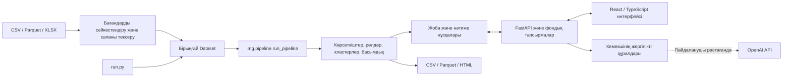

# Граф денег — ақша аударымдарын талдау

[Русский](README.md) | [English](README.en.md) | [Қазақша](README.kk.md)

«Граф денег» — ақша аударымдары арасындағы байланысты зерттеуге арналған жергілікті қолданба. Ол CSV, Parquet және XLSX файлдарын қабылдап, қатысушылардың рөлдерін, өзара байланысқан топтарды және тексеру басымдығын есептейді. Талдаушы графтан күмән туғызған байланысты таңдап, оның негізіндегі көрсеткіштер мен аударымдарды қарай алады.

Мақсат — **кімді алдымен тексеру керек және неге?** деген сұраққа деректерге сүйенген жауап беру. Есептелген рөлдер мен байланыстар — тексеруге арналған болжамдар; олар кінәні дәлелдемейді.


## Мазмұны

- [Мүмкіндіктер](#features)
- [Docker арқылы іске қосу](#docker)
- [Компьютерде іске қосу және әзірлеу](#development)
- [Деректерді жүктеу](#input)
- [ЖИ көмекшісі және баптау](#ai)
- [Архитектура](#architecture)
- [Деректерді сақтау, сақтық көшірме және жаңарту](#storage)
- [Тексерулер](#checks)
- [Жиі кездесетін мәселелер](#troubleshooting)
- [Модельдің шектеулері және құпиялылық](#limitations)
- [Қосымша құжаттар](#documentation)

<a id="features"></a>

## Мүмкіндіктер

- **Деректерді дайындау:** бағандарды сәйкестендіру, бастапқы жолдарды алдын ала қарау, сапаны тексеру және есептеу параметрлерін растау.
- **Түсіндірілетін талдау:** қаражат жинайтын, әрі қарай өткізетін немесе тарататын түйіндердің белгілері; іске қосылған ережелер мен сандық негіздеме.
- **Интерактивті граф:** идентификатор бойынша іздеу, көршілерді ашу, сүзгілер, уақыт шкаласы, түйіндерді жылжыту, бекіту және PNG суретін сақтау.
- **Топтар мен басымдықтар:** кластерлер, сұрыпталатын түйіндер кестесі, таңдалған жолдарды экспорттау.
- **Сценарийлер:** таңдалған түйіндерді есептен алып тастау, қалған ағынды кездейсоқ таңдаумен салыстыру және Sankey диаграммасы.
- **Талдаушының ісі:** таңдалған түйіндер, жазбалар, сценарийлер және басып шығаруға болатын HTML-досье. PDF алу үшін браузердің «Басып шығару → PDF ретінде сақтау» мүмкіндігін қолданыңыз.
- **Көмекші:** API кілтінсіз жұмыс істейтін жергілікті әрекеттер және қалауыңыз бойынша OpenAI арқылы еркін қойылған сұрақтарға жауап беру.
- **Интерфейс:** қазақша, орысша және ағылшынша; ашық және күңгірт тақырыптар.

<a id="docker"></a>

## Docker арқылы іске қосу

Docker Desktop немесе Docker Engine және **Docker Compose 2.24 не одан жаңа нұсқасы** қажет. Windows жүйесінде Docker Linux контейнерлерін іске қосуы тиіс. Хостқа Python немесе Node.js орнату қажет емес: образ интерфейсті Node.js 22 арқылы жинайды, сервер Python 3.12 ортасында жұмыс істейді.

Репозиторийді көшіріп, оның түбірлік бумасынан орындаңыз:

```sh
git clone https://github.com/BAITC-Hacks/hack-61c5ca4c-orbit-digital-ako.git
cd hack-61c5ca4c-orbit-digital-ako
docker compose up --build -d
```

- Қолданба: **[http://localhost:8000](http://localhost:8000)**.
- API анықтамасы: **[http://localhost:8000/api/docs](http://localhost:8000/api/docs)**.
- Күйін тексеру: **[http://localhost:8000/api/health](http://localhost:8000/api/health)**.

Алғашқы жинақтауға интернет керек. Кейін негізгі талдау жергілікті ортада орындалады; сыртқы ЖИ сұраулары ғана OpenAI қосылымын қажет етеді. `.env` файлы мен API кілті бастапқы іске қосу үшін міндетті емес.

Алдымен интерфейстен мысал жобасын ашыңыз немесе жаңа талдау құрып, өз файлдарыңызды жүктеңіз.

Қызметті басқару:

```sh
docker compose ps
docker compose logs --tail=100 app
docker compose stop app
docker compose start app
```

Егер 8000 порты бос болмаса, хосттағы портты өзгертіңіз. Мысалы, PowerShell ішінде:

```powershell
$env:MONEYGRAPH_PORT = "8080"
docker compose up -d
```

Bash немесе zsh ішінде:

```sh
MONEYGRAPH_PORT=8080 docker compose up -d
```

Бұл жағдайда қолданбаны `http://localhost:8080` арқылы ашыңыз. Контейнер ішіндегі порт 8000 болып қалады. Кейінгі Compose пәрмендерінде де осы орта айнымалысын сақтаңыз.

<a id="development"></a>

## Компьютерде іске қосу және әзірлеу

Ұсынылатын орта — **Python 3.12**. Дайын интерфейс `money_graph/web/dist/` ішінде бар; оны жай іске қосу үшін Node.js қажет емес.

Windows / PowerShell, репозиторийдің түбірлік бумасынан:

```powershell
py -3.12 -m venv .venv
.\.venv\Scripts\python.exe -m pip install -r money_graph/requirements.txt
.\.venv\Scripts\python.exe money_graph/serve.py
```

Linux / macOS:

```sh
python3.12 -m venv .venv
.venv/bin/python -m pip install -r money_graph/requirements.txt
.venv/bin/python money_graph/serve.py
```

Браузерден [http://127.0.0.1:8000](http://127.0.0.1:8000) мекенжайын ашыңыз. Серверді тоқтату үшін терминалда `Ctrl+C` басыңыз.

Интерфейсті өзгерту үшін **Node.js 22.12 немесе одан жаңа 22.x нұсқасын** пайдаланыңыз. Серверді бірінші терминалда қалдырып, екінші терминалда орындаңыз:

```sh
cd money_graph/web
npm ci
npm run dev
```

Vite көрсеткен жергілікті мекенжайды ашыңыз. Ол `/api` сұрауларын 8000 портындағы Python серверіне жібереді. Өзгерістерді дайын интерфейске енгізу үшін:

```sh
npm run build
```

Хакатонның бастапқы үш Parquet файлын интерфейссіз талдау:

```sh
cd money_graph
python run.py
python check.py
```

Бұл пәрмендерде виртуалды ортадағы `python` қолданылуы тиіс. `run.py` үшін `--data`, `--out`, `--config` параметрлері бар. `check.py` бастапқы хакатон жиынының шарттарын, соның ішінде 2 248 түйінді тексереді; ол кез келген пайдаланушы жобасына арналған әмбебап тексергіш емес.

CSV экспортындағы `role` бағаны техникалық тапсырмадағы алты мәнмен шектеледі: `consolidator`, `transit`, `distributor`, `terminal`, `coordinator`, `peripheral`. Деректерді жинау шекарасында кесілген түйін үшін `role=peripheral`, `role_detail=truncated`, `is_truncated=True`, ал `role_base=role` болып беріледі. Бұл — экспорт сөздігіне техникалық сәйкестендіру; түйіннің іс-әрекетін қайта жіктеу емес. Бастапқы жиындағы шекарада орналасқан 444 түйіннің бәрі сақталады; аналитикалық граф, Parquet нәтижелері және басымдық есебі `truncated` рөлін бөлек ажыратады. Осы талап CLI экспортына, таңдалған жолдардың CSV файлына, жеке CSV және ZIP жүктеулеріне, соның ішінде бұрын кэштелген нәтижелерді жүктеуге де қолданылады.

<a id="input"></a>

## Деректерді жүктеу

Жүктеу қадамдары: **файлдар → бағандар → параметрлер → сапа → есептеу**. Ұсынылған сәйкестендіруді талдаушы растайды; бағандарды автоматты тану талдауды өздігінен бастамайды.

Қолдау көрсетілетін пішімдер:

- **CSV:** UTF-8, UTF-8 BOM немесе Windows-1251; үтір, нүктелі үтір, табуляция немесе `|` бөлгіші.
- **Parquet:** баған түрлері сақталған кестелер.
- **XLSX:** жүктеу кезінде парақ таңдалады; формулалар мен макростар орындалмайды.

Жобаға 20 файлға дейін жүктеуге болады. Әдепкі шек — әр файлға 500 МБ; ол `money_graph/config.json` ішіндегі `upload_limit_mb` арқылы беріледі.

Бағандардың бастапқы атаулары басқа болуы мүмкін: оларды жүктеу шеберінде мына өрістерге сәйкестендіріңіз.

- **Транзакциялар:** `src` — жіберуші, `dst` — алушы, `amount` — сома, `date` — күн. Күн міндетті емес, бірақ уақытқа тәуелді көрсеткіштер үшін қажет.
- **Жиынтық байланыстар:** `src`, `dst`, `amount`, `n_tx` — бір бағыттағы жалпы сома мен аударым саны. `n_tx` берілмесе, әр жол үшін 1 деп алынады. Транзакциялар бар болса, байланыстар солардан қайта есептеледі.
- **Түйіндер, міндетті емес:** `id` — идентификатор, `depth` — бастапқы түйіннен қашықтық, `is_seed` — бастапқы тізімге тиесілілік белгісі. Кесте болмаса, түйіндер байланыстардан құрылады.
- **Бастапқы түйіндер, міндетті емес:** жеке файлдағы `id` бағаны. Оларды `is_seed` белгісімен немесе интерфейсте тізім ретінде де көрсетуге болады. Құжаттар мен кодта бұл түйіндер *seed* деп аталады.

Ең аз дегенде транзакциялар немесе жиынтық байланыстар кестесі қажет. Қарапайым CSV мысалы:

```csv
src,dst,amount,date
account_001,account_002,125000,2026-07-01
account_002,account_003,50000,2026-07-02
```

Идентификаторларды Excel ішінде мәтін ретінде сақтаңыз: ұзын сандардың дәлдігі жоғалуы немесе басындағы нөлдер түсіп қалуы мүмкін. `1 234,50` түріндегі сомалар танылады; күндерді түсіндіру кезінде күн-ай ретін таңдауға болады.

Валютаны, белгілі іріктеу шегін және деректерді жинау тереңдігін бөлек көрсетіңіз. Граф бойынша есептелген қашықтық деректердің қай деңгейге дейін жиналғанын дәлелдемейді. Жинау шекарасы белгісіз болса, шекарада кесілген түйіндер туралы ереже қолданылмайды.

Сапаны тексеру жетіспейтін мәндерді, қайталанатын жолдарды, өзіне аударымдарды, күндер мен сомаларды және кестелер арасындағы сәйкестікті көрсетеді. `src` / `dst` / `amount` жарамсыз жолдар 5%-дан асса, есептеу бұғатталады; азырақ болса, олар ескертумен алынып тасталады. Теріс және нөлдік сомалар да алынып тасталады. Бірдей транзакциялар автоматты жойылмайды — олардың қайталанған жүктеу ме, әлде нақты бөлек операциялар ма екенін талдаушы тексеруі тиіс.

<a id="ai"></a>

## ЖИ көмекшісі және баптау

API кілтінсіз төрт әрекет қолжетімді: таңдалған түйіндерді түсіндіру, ортақ алушыларды іздеу, бағытталған жолды табу және қандай қосымша дерек керек екенін көрсету. Бұлар жергілікті есептеулерді пайдаланады.

Еркін қойылған сұрақтарды OpenAI-ға жіберу үшін `money_graph/.env.example` негізінде **`money_graph/.env`** файлын жасаңыз. Бар файлды қайта көшіріп жазбаңыз. Оның ішінде:

```dotenv
OPENAI_API_KEY=YOUR_API_KEY
OPENAI_MODEL=gpt-4.1-mini
```

`YOUR_API_KEY` орнына өз кілтіңізді тек жергілікті файлда енгізіңіз. Кілтті браузерге, Git-ке немесе чатқа жібермеңіз. Модельді өз API жобаңызда қолжетімді модельге ауыстыруға болады.

Docker образына OpenAI клиенті кірген. `.env` контейнерді іске қосу кезінде беріледі, образға енгізілмейді. Файлды өзгерткен соң контейнерді қайта жасаңыз:

```sh
docker compose up -d --force-recreate app
```

Жергілікті Python ортасында қосымша тәуелділікті орнатып, серверді қайта іске қосыңыз:

```sh
python -m pip install -r money_graph/requirements-ai.txt
```

Әр сыртқы сұрау алдында интерфейс деректерді жіберуге растау сұрайды. OpenAI-ға сұрақ, идентификаторлар және шақырылған құралдардың нәтижелері жіберіледі; бастапқы файлдар тұтас жіберілмейді. Жауап түйіндер мен байланыстарға тексерілетін сілтемелер береді. Көмекші деректерді, рөлдерді немесе ережелерді өзгертпейді. API сұраулары провайдердің тарифіне сай ақылы болуы мүмкін.

Есептеу параметрлері `money_graph/config.json` ішінде, ал әр жобаның жеке параметрлері оның бумасында сақталады. Интерфейстегі ережелер экраны шектер мен басымдық салмақтарын өзгертіп, нәтижені алдын ала қарауға мүмкіндік береді. Өзгерістерді сақтау толық есептеуді бастайды.

ЖИ, сыртқы API және конфигурация туралы толық нұсқаулық: **[INTEGRATIONS.md](money_graph/docs/INTEGRATIONS.md)**.

<a id="architecture"></a>

## Архитектура



Веб-қолданба мен CLI бір аналитикалық ядроны қолданады. Интерфейс React / TypeScript негізінде жасалған; графты Sigma.js пен graphology көрсетеді. Сервер FastAPI арқылы жобаларға, есептеуге және экспортқа қолжетімділік береді. Орындалу барысы SSE арқылы жеткізіледі.

Негізгі бумалар:

```text
compose.yaml                 Docker қызметі және тұрақты том
Dockerfile                   Интерфейсті жинау және Python серверінің образы
money_graph/
  serve.py                   Жергілікті серверді іске қосу
  run.py, check.py            Хакатон жиынын есептеу және тексеру
  config.json                Әдепкі параметрлер
  mg/                        Талдау, деректерді оқу, ережелер, экспорт, көмекші
  api/                       HTTP API, жоба қоймасы, фондық тапсырмалар
  web/src/                   Интерфейстің бастапқы коды
  web/dist/                  Жиналған интерфейс
  data/                      Мысал деректер
  projects/                  Жергілікті пайдаланушы жобалары
  tests/, tools/, docs/      Тексерулер, утилиталар және құжаттар
tests/                       Ортақ келісімдер мен көмекші тексерулері
```

<a id="storage"></a>

## Деректерді сақтау, сақтық көшірме және жаңарту

Жергілікті іске қосқанда жобалар әдепкіде `money_graph/projects/` ішінде сақталады. Docker Compose `moneygraph_data` атты логикалық томды `/data` жолына қосып, `MONEY_GRAPH_PROJECTS=/data/projects` параметрін береді. Жобалар контейнерді қайта жасағанда сақталады. Compose нақты том атауына жоба атауын префикс ретінде қосуы мүмкін.

Жоба құрамында бастапқы файлдар, сәйкестендіру, конфигурация, сапа есебі, нормаланған кестелер, нәтиже нұсқалары, пікірлер және талдаушы істері бар. Кэштің сәйкестігі деректерге, конфигурацияға және алгоритм нұсқасына тәуелді.

**Фондық тапсырмалар кезегі жедел жадта сақталады.** Сервер қайта іске қосылғанда аяқталған нәтижелер сақталады, бірақ орындалып жатқан тапсырма автоматты жалғаспайды; оны қайта бастау керек. Қазіргі нұсқада бөлек қалпына келетін кезек қызметі жоқ.

Docker жобаларының келісілген сақтық көшірмесін алу үшін есептеулердің аяқталуын күтіп, әр көшірмеге жаңа бума атауын қолданыңыз. PowerShell ішінде:

```powershell
New-Item -ItemType Directory -Force backups | Out-Null
docker compose stop app
docker compose cp app:/data ./backups/data-20260923
docker compose start app
```

Linux / macOS ішінде бірінші жолдың орнына `mkdir -p backups` қолданыңыз. `backups/` Git-тен және Docker жинағынан шығарылған. Көшірменің ішінде `projects/` және қажетті жобалар бар екенін тексеріңіз. Жергілікті іске қосуда серверді тоқтатып, `money_graph/projects/` бумасын тұтас көшіріңіз. Код пен әдепкі параметрлердің нұсқасын да белгілеңіз. API кілтін бөлек қорғалған жерде сақтаңыз: Docker томының көшірмесі хосттағы `money_graph/.env` файлын қамтымайды. Қалпына келтіру мен жергілікті жобаларды Docker-ге көшіру қадамдары [DEPLOYMENT.md](money_graph/docs/DEPLOYMENT.md) ішінде берілген; жоғарыдағы көшірме үшін бастапқы жоба бумасы `backups/data-20260923/projects/` болады.

**`docker compose down -v` деректер томын жояды.** Контейнерлерді ғана тоқтату немесе қайта жинау үшін `-v` параметрін қолданбаңыз. Интерфейстен жобаны жою оның бастапқы файлдары мен сақталған нәтижелерін де жояды; бұрын жүктеп алынған экспорттар мен сақтық көшірмелер бөлек қалады.

Кодты жаңарту алдында өзгерістерді сақтап, деректердің сақтық көшірмесін алыңыз. Содан кейін репозиторийдің түбірінде:

```sh
git pull --ff-only
docker compose up --build -d
docker compose ps
```

Егер `git pull --ff-only` жергілікті өзгерістерге немесе тармақтардың алшақтауына байланысты тоқтаса, оларды сақтап, айырмашылықтарды шешіңіз; өзгерістерді күштеп өшірмеңіз. Жаңартудан кейін сақталған жобаларды ашып, қажет болса талдауды қайта есептеңіз.

<a id="checks"></a>

## Тексерулер

Виртуалды орта белсенді кезде, репозиторий түбірінен:

```sh
python -m pip install -r money_graph/requirements-dev.txt
python -m pip install -r money_graph/requirements-ai.txt
python -m pytest tests money_graph/tests -q
```

Көмекші тесттері провайдердің жалған жауаптарын қолданады; ақылы OpenAI сұрауы қажет емес.

Интерфейстің типтерін тексеріп, өндірістік жинақты жасау:

```sh
cd money_graph/web
npm ci
npm run build
```

Браузерлік сценарийлер үшін `money_graph/web/` бумасында, виртуалды орта белсенді кезде сынақ деректерін жасап, Playwright браузерін орнатыңыз:

```sh
python ../tools/make_synthetic.py --out ../.local/synthetic
npx playwright install chromium
npm run test:e2e
```

Playwright әдепкіде Chromium-ды қолданады. Баптау Python серверін өзі іске қосады немесе CI ортасынан тыс кезде жұмыс істеп тұрған серверді пайдаланады; сондықтан виртуалды ортадағы `python` PATH ішінде болуы керек. Басқа орнатылған браузер үшін `PLAYWRIGHT_BROWSER` айнымалысына оның орындалатын файлының абсолютті жолын беріңіз. Тесттер жергілікті сынақ жобаларын жасайды.

Басқа порттағы дайын серверді, мысалы Docker-ді тексеру үшін `PLAYWRIGHT_BASE_URL` орнатыңыз. Бұл режимде Playwright Python серверін өзі іске қоспайды. PowerShell мысалы:

```powershell
$env:PLAYWRIGHT_BASE_URL = "http://127.0.0.1:8080"
npm run test:e2e
```

Тексеру әдістемесі мен бұрынғы өлшемдер [VALIDATION.md](money_graph/docs/VALIDATION.md) ішінде берілген. Олар кез келген компьютер мен кез келген тығыз граф үшін өнімділік кепілдігі емес.

<a id="troubleshooting"></a>

## Жиі кездесетін мәселелер

- **Docker `env_file.required` параметрін танымайды.** `docker compose version` арқылы нұсқаны тексеріңіз; кемінде 2.24 қажет. Ескі `docker-compose` орнына `docker compose` қолданыңыз.
- **Қолданба ашылмайды.** Docker қызметінің іске қосылғанын, `docker compose ps` күйін және `docker compose logs --tail=100 app` журналын тексеріңіз. Браузерде Compose жариялаған хост портын пайдаланыңыз.
- **Порт бос емес.** Басқа жергілікті серверді тоқтатыңыз немесе жоғарыдағы `MONEYGRAPH_PORT` параметрін қолданыңыз.
- **Жаңартылған интерфейс көрінбейді.** Docker үшін `docker compose up --build -d`, жергілікті әзірлеу үшін `npm run build` орындап, бетті қайта жүктеңіз.
- **ЖИ сұрақтары қолжетімсіз.** `money_graph/.env` ішінде кілттің бар екенін, модельге қолжетімділікті және API жобасының лимитін тексеріңіз. Docker контейнерін қайта жасаңыз; жергілікті ортада `requirements-ai.txt` орнатылған болуы тиіс. Жергілікті көмекші кілтсіз жұмыс істейді.
- **Сапаны тексеру есептеуге өткізбейді.** Жіберуші, алушы және сома бағандарының сәйкестігін, күн пішімін, жарамсыз жолдар туралы хабарламаларды тексеріңіз.
- **Қайта іске қосқаннан кейін есеп тоқтап қалған.** Жобаны ашып, есептеуді қайта бастаңыз: орындалып жатқан тапсырмалар жедел жадтан қалпына келмейді.
- **Үлкен граф баяу.** Алдымен белгілі түйіннің шағын маңайын немесе кластерлер графын ашыңыз. Сервер көрсеткен мүмкіндіктер мен жуық есептеу ескертулерін оқыңыз.

<a id="limitations"></a>

## Модельдің шектеулері және құпиялылық

Қазіргі `main` нұсқасында **жиынтық байланыстарға негізделген haircut моделі** қолданылады; әдепкіде `taint_iterations=8`. Seed түйіндерінен тараған модельдік үлес граф бойымен есептеледі. Бұл нақты соманы күндер бойынша қадағалайтын немесе FIFO қағидасымен қалдықты жұмсайтын модель емес.

- **Белгіленген ағын — бірегей ақша сомасы емес.** Бір қаражат бірнеше байланыста есептелуі мүмкін; нәтиже мен түйінді алып тастау әсері итерация санына тәуелді.
- **Жылдам транзит күндердің жақындығымен бағаланады.** Кіріс сомасы бірнеше шығысқа бөлініп сәйкестендірілмейді; бір күн ішіндегі операциялардың нақты реті белгісіз.
- **Бастапқы қалдық пен сыртқы аударымдар көрінбеуі мүмкін.** Графтағы жол нақты бір ақша бірлігінің қозғалысын дәлелдемейді.
- **Рөл бағасы кінә ықтималдығы емес.** Ережелердің дәлдігін бағалау үшін тәуелсіз таңбаланған деректер керек. AUC көрсеткіші бар болса, ол тек жинау шекарасынан кейін аударымның жалғасуын бағалайтын модельге қатысты.
- **Деректер толық болмауы мүмкін.** Күндер жоқ болса, уақыт көрсеткіштері есептелмейді. Seed жоқ болса, басымдық құрылым мен айналымға сүйенеді, ал алып тастау сценарийі байқалған жалпы ағынды өлшейді. Шекара моделі үшін деректер жеткіліксіз болса, оның бағасы берілмейді.
- **Ірі желілерде жуықтаулар бар.** 5 000 түйіннен кейін аралық орталықтылық таңдама арқылы бағаланады; 20 000 түйіннен кейін жеке алып тастау әсері кандидаттармен шектеледі. Есептелмеген әсер нөлге тең деп көрсетілмейді.

Қазіргі қолданбада пайдаланушыларды тіркеу, аутентификация және рөлдер бойынша қолжетімділікті бөлу жоқ. Ол бір талдаушының жергілікті жұмысына арналған. Ортақ желіге шығару үшін осы тетіктерді және қорғалған қосылымды бөлек ұйымдастыру қажет.

Негізгі талдау мен жергілікті құралдар деректерді сыртқа жібермейді. OpenAI сұраулары бөлек растаумен жіберіледі. Жоба файлдары қолданба деңгейінде шифрланбайды; HTML-досье мен автономды `viewer.html` өз ішінде деректерді қамтиды. Оларды бастапқы кестелер сияқты қорғалатын жұмыс материалдары ретінде сақтаңыз.

<a id="documentation"></a>

## Қосымша құжаттар

- [Қолдану нұсқаулығы, API және толық шектеулер](money_graph/README.md).
- [ЖИ, конфигурация және сыртқы API интеграциялары](money_graph/docs/INTEGRATIONS.md).
- [Docker, сақтық көшірме және қалпына келтіру](money_graph/docs/DEPLOYMENT.md).
- [Тексеру нәтижелері мен өлшеу шарттары](money_graph/docs/VALIDATION.md).
- [Демонстрация сценарийі](money_graph/docs/DEMO_SCRIPT.md).
- [Бастапқы модель әдістемесі](money_graph/docs/BASELINE_METHOD.md).
- [Іске қосылған сервердің API анықтамасы](http://localhost:8000/api/docs).
