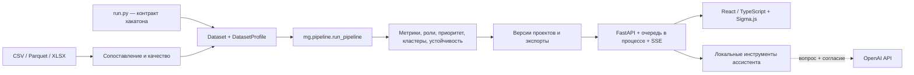

# Граф денег

[Русский](README.md) | [English](README.en.md) | [Қазақша](README.kk.md)

Локальная платформа для исследования переводов. Загрузите банковскую выгрузку, подтвердите назначение колонок и проверьте качество данных — приложение построит граф, объяснит предполагаемые роли участников, расставит приоритеты проверки и позволит сравнить сценарии исключения узлов. Результаты можно сохранить в дело и выгрузить в печатное досье.

**Текущая версия — универсальный MVP для одного аналитика на своём компьютере. Аутентификации и личных кабинетов нет.** Роли и оценки потока — аналитические гипотезы, которые требуют проверки, а не выводы о вине или доказательство происхождения конкретных денег.


## Содержание

- [Возможности и рабочий процесс](#workflow)
- [Быстрый запуск в Docker](#docker)
- [Запуск без Docker: Windows, macOS, Linux](#local)
- [Настройки и переменные окружения](#config)
- [Форматы импорта и качество данных](#import)
- [Расчёт и его ограничения](#model)
- [Ассистент и API](#integrations)
- [Архитектура и структура репозитория](#architecture)
- [Хранение, обновление и резервная копия](#storage)
- [Разработка и проверки](#development)
- [Решение проблем](#troubleshooting)
- [Документация, планы и участие](#contributing)

<a id="workflow"></a>
## Возможности и рабочий процесс

1. **Создать проект.** «Открыть пример» копирует поставляемый набор хакатона и запускает расчёт; «Новый анализ» открывает мастер загрузки своих файлов.
2. **Подготовить данные.** Мастер проводит через файлы, сопоставление колонок, параметры и качество. Автопредложения можно исправить; расчёт начинается после подтверждения.
3. **Исследовать сеть.** Обзор показывает показатели, топ-10, роли, кластеры, устойчивость и ограничения данных. В расследовании доступны окружение узла на 1–3 перехода, мета-граф кластеров, инспектор правил, переводы по ребру, временная шкала и проигрывание периода.
4. **Проверить гипотезу.** Симуляция исключает выбранные узлы или топ-N, сравнивает эффект со случайным выбором и показывает изменения компонент и кластеров. Исключение меняет расчётный сценарий, а не банковские операции.
5. **Сохранить результат.** Дело объединяет узлы, заметки и сценарии. HTML-досье содержит снимок версии расчёта, связи, основания выводов, трассировку, запросы недостающих данных и конфигурацию. Для PDF откройте досье и выберите печать браузера → «Сохранить как PDF».

Граф поддерживает поиск, фильтры, геометрические формы ролей, пиктограммы или круги, перемещение, закрепление и скрытие узлов, мини-карту, новую раскладку, полный экран и PNG. Вывод до 3 000 узлов выполняется по явному запросу. Таблица узлов использует виртуализацию, серверный поиск, сортировку и пагинацию; доступны настройка колонок, сохранённый вид, экспорт и массовое добавление в сценарий или дело. Карточки кластеров показывают мини-подграфы до 24 узлов, состав и гипотезу. Выбранный узел и фильтры сохраняются в ссылке.

В настройках правил можно сравнить абсолютные и адаптивные пороги, просмотреть изменения ролей, изменить нормируемые веса приоритета, применить пресет и запустить полный пересчёт. Обратная связь аналитика формирует предложения калибровки; они не применяются автоматически.

Интерфейс доступен на русском, казахском и английском, со светлой и тёмной темой и учётом системного предпочтения уменьшенной анимации. Основное рабочее место — настольный браузер; мобильный вид предназначен прежде всего для обзора и карточек.

Горячие клавиши: **Ctrl/⌘+K** или **/** — поиск; **E** — раскрыть соседей; **B** — добавить узел в симуляцию; **A** — добавить в дело; **Esc** — закрыть диалог, инспектор или полный экран; **?** — помощь и глоссарий. E/B/A действуют вне полей ввода. Поиск и таблица позволяют выбирать узлы без мыши; вкладки инспектора поддерживают стрелки и Home/End.

<a id="docker"></a>
## Быстрый запуск в Docker

Нужны Git и Docker с Linux-контейнерами: Docker Desktop на Windows/macOS или Docker Engine с Compose на Linux. Версия **Docker Compose — 2.24.0 или новее**: используется необязательный файл окружения. Python и Node.js на компьютере для этого способа не нужны.

```sh
git clone --branch main https://github.com/BAITC-Hacks/hack-61c5ca4c-orbit-digital-ako.git
cd hack-61c5ca4c-orbit-digital-ako
docker compose version
docker compose up --build -d
docker compose ps
```

Откройте **[http://127.0.0.1:8000](http://127.0.0.1:8000)** и нажмите «Открыть пример». API и его локальная документация доступны на **[/api/docs](http://127.0.0.1:8000/api/docs)**, проверка работоспособности — на **[/api/health](http://127.0.0.1:8000/api/health)**.

Первая сборка скачивает базовые образы, Python-зависимости и npm-пакеты. Dockerfile собирает React-интерфейс в этапе Node.js 22, затем запускает Python 3.12 от пользователя без прав root. SDK OpenAI уже включён; ключ для обычного анализа и локальных действий ассистента не нужен. Приложение работает одним процессом API, поскольку реестр фоновых задач находится в памяти процесса.

Compose публикует порт **только на `127.0.0.1`** и хранит проекты в отдельном томе. Не меняйте привязку на публичный интерфейс для совместной работы: в текущем MVP нет аутентификации. После установки основной анализ работает без интернета; сеть нужна для внешних вопросов к OpenAI и обновлений.

Управление из корня репозитория:

```sh
docker compose logs --tail=100 app
docker compose stop app
docker compose start app
```

`docker compose down` удаляет контейнер и сеть, сохраняя том с данными. **`docker compose down -v` удаляет и том с проектами** — не используйте этот вариант при обычном обновлении.

<a id="local"></a>
## Запуск без Docker: Windows, macOS, Linux

Рекомендуется **Python 3.12**. Готовая сборка интерфейса включена в `money_graph/web/dist/`, поэтому Node.js для обычного запуска не требуется. Устанавливайте зависимости в отдельное виртуальное окружение.

### Windows, PowerShell

Из корня клонированного репозитория:

```powershell
py -3.12 -m venv .venv
.\.venv\Scripts\python.exe -m pip install -r money_graph/requirements.txt
cd money_graph
..\.venv\Scripts\python.exe serve.py
```

Команды используют интерпретатор напрямую и не требуют разрешать выполнение `Activate.ps1`. Если Python установлен без команды `py`, создайте окружение через `python -m venv .venv`, предварительно проверив `python --version`.

### macOS и Linux

Из корня клонированного репозитория:

```sh
python3.12 -m venv .venv
.venv/bin/python -m pip install -r money_graph/requirements.txt
cd money_graph
../.venv/bin/python serve.py
```

На Linux пакет для создания виртуальных окружений может устанавливаться отдельно через пакетный менеджер дистрибутива. Запускайте `serve.py` **из папки `money_graph`**: приложение импортируется как `api.main:app`. Адрес — **http://127.0.0.1:8000**. Остановка — Ctrl+C в терминале.

<a id="config"></a>
## Настройки и переменные окружения

Файл [`money_graph/config.json`](money_graph/config.json) задаёт исходные пороги, веса ролей и приоритета, параметры кластеризации, расчёта потока и ограничения загрузки. Новый проект получает свою копию настроек; для существующего проекта меняйте параметры через интерфейс или API. Граница выгрузки `max_depth` и порог сбора `collection_threshold` в новом пользовательском проекте остаются неизвестными до явного указания аналитиком, даже если исходный набор хакатона имеет такие значения.

Переменные сервера:

- **`OPENAI_API_KEY`** — необязательный ключ для внешних вопросов. Хранится только на сервере. Без него работают анализ и локальные инструменты ассистента.
- **`OPENAI_MODEL`** — модель внешнего ассистента; пример настройки использует `gpt-4.1-mini`.
- **`MONEY_GRAPH_PROJECTS`** — каталог рабочих проектов. Без Docker по умолчанию используется `money_graph/projects`. Задавайте эту переменную в окружении процесса **до запуска** сервера; не полагайтесь на её загрузку из `.env`. В Compose она явно установлена в `/data/projects`.
- **`MONEYGRAPH_PORT`** — только для Compose: порт компьютера, по умолчанию `8000`. Внутри контейнера остаётся порт `8000`; `serve.py` эту переменную не использует.

Файл [`money_graph/.env.example`](money_graph/.env.example) содержит пустой ключ. Для настройки OpenAI скопируйте его в необязательный `money_graph/.env`, только если файл ещё не существует.

PowerShell, из корня репозитория:

```powershell
if (-not (Test-Path money_graph/.env)) { Copy-Item money_graph/.env.example money_graph/.env }
```

Bash, из корня репозитория:

```sh
test -f money_graph/.env || cp money_graph/.env.example money_graph/.env
```

Добавьте ключ в этот локальный файл. Не отправляйте его в чат, не вводите в браузере и не добавляйте в Git. `.env` исключён из Git и контекста Docker-сборки; Compose читает его при создании контейнера. Для применения изменений окружения:

```sh
docker compose up -d --force-recreate app
```

При запуске без Docker дополнительно установите SDK из папки `money_graph` и перезапустите сервер:

```sh
python -m pip install -r requirements-ai.txt
```

Здесь и далее `python` означает интерпретатор вашего виртуального окружения: активируйте его или подставляйте путь из раздела запуска. У Docker-образа SDK уже установлен.

Чтобы выбрать другой порт Compose, в PowerShell задайте `$env:MONEYGRAPH_PORT="8001"`, затем выполните `docker compose up -d`. В Bash используйте `MONEYGRAPH_PORT=8001 docker compose up -d`. После этого адрес приложения — `http://127.0.0.1:8001`.

<a id="import"></a>
## Форматы импорта и качество данных

Поддерживаются **CSV**, **Parquet** и **XLSX**. Для CSV распознаются UTF-8, UTF-8 BOM, Windows-1251 и разделители `,`, `;`, табуляция, `|`. Для XLSX выбирается лист; формулы и макросы не выполняются. По умолчанию можно загрузить до **20 файлов на проект**, до **500 МБ каждый**; размер задаётся через `upload_limit_mb` в конфигурации. Размер распакованного XLSX ограничен четырьмя лимитами файла.

Названия исходных колонок могут отличаться: мастер предлагает соответствия по русским и английским синонимам и типам значений, показывает уверенность, исходные строки и результат преобразования. Аналитик подтверждает сопоставление перед анализом.

Канонические таблицы:

- **Транзакции:** `src` — отправитель, `dst` — получатель, `amount` — положительная сумма; `date` — необязательная дата. Для анализа нужна эта таблица **или** таблица агрегированных связей.
- **Связи:** `src`, `dst`, `amount` — сумма переводов между парой; `n_tx` — число переводов, при отсутствии принимается равным 1. Если загружены транзакции, связи пересчитываются из них.
- **Узлы:** `id`, необязательные `depth` и `is_seed`. Таблица необязательна: недостающие участники добавляются из связей.
- **Исходные участники (seed):** необязательная таблица с `id`. Их также можно отметить через `is_seed` или ввести списком. Seed задаёт исходную точку исследования и допущение модели потока.

Минимальный пример CSV с транзакциями:

```csv
src,dst,amount,date
A001,B002,12500.00,2026-09-01
B002,C003,7000.00,2026-09-02
```

Идентификаторы в ядре, API и браузере — строки. Сохраняйте значимые ведущие нули в исходном файле: Excel может убрать их ещё до импорта. Суммы вида `1 234,50` поддерживаются; при запятой внутри поля используйте корректное CSV-кавычкование или другой разделитель. Для неоднозначных дат выбирается порядок дня и месяца. Валюта задаётся для проекта; конвертации валют приложение не выполняет, поэтому суммы должны быть приведены к общей единице заранее.

В параметрах указываются валюта, seed, известный порог сбора данных, известная максимальная глубина выгрузки и язык текстовых оснований выводов. Вычисленная расстоянием по графу глубина **не означает границу выгрузки**: без явного `max_depth` классификация обрезки отключена.

Проверка качества выявляет пропуски, дубли, петли, некорректные суммы и даты, расхождения связей и транзакций, изолированные seed и компоненты графа. Если более 5% строк не содержат обязательных `src`, `dst` или `amount`, расчёт блокируется; при меньшей доле строки исключаются с предупреждением. Отрицательные и нулевые суммы исключаются: возвраты не преобразуются автоматически в обратные переводы. Совпадающие транзакции сохраняются и требуют проверки аналитиком.

При неполных данных приложение сокращает доступный анализ:

- Без дат временные метрики выключены; транзит оценивается по соотношению сумм. Если даты есть лишь у части переводов, временные метрики используют датированные строки, а обороты — все допустимые строки.
- Без глубины, но с seed, рассчитывается направленное расстояние BFS. Без глубины и seed обрезка не оценивается.
- Без seed приоритет опирается на структуру и обороты с перенормированием весов, а симуляция измеряет общий наблюдаемый поток.
- Модель продолжения за границей выгрузки требует дат, не менее 100 обучающих узлов и обоих классов. Если условия не соблюдены, `p_onward` отсутствует, а причина доступна в ограничениях.

Доступность расчётов отражена в `summary.capabilities`, на обзоре и в проверке качества. Неполная выгрузка не становится полной благодаря модели или ассистенту.

<a id="model"></a>
## Расчёт и его ограничения

CLI и веб-проекты используют общее ядро `mg.pipeline.run_pipeline`: метрики направленного графа → распространение потока → эффект исключения узлов → оценка обрезки → роли и приоритет → кластеры → устойчивость. Назначение ролей и объяснение правил используют единый интерпретатор, поэтому в инспекторе можно проверить сработавшие условия.

Текущая модель потока — **итеративное пропорциональное распределение, haircut**. Исходным seed приписывается доля 1; остальные узлы передают долю, полученную из входящих связей. Расчёт идёт по агрегированному графу, **не моделирует хронологические остатки на счетах**. Даты используются в отдельных признаках и интерфейсе, но не превращают эту модель в последовательное отслеживание переводов. Сумма потока по рёбрам может учитывать одну и ту же условную денежную массу на нескольких переходах; она отличается от поступлений на наблюдаемые конечные узлы, которые показывает Sankey до и после исключения узлов.

Симуляция пересчитывает модель после удаления узлов. Её результат зависит от полноты сети, заданных seed и параметров; это оценка сценария, а не прогноз действий участников. Приоритет — относительный порядок проверки узлов внутри расчёта, не вероятность нарушения. AUC, когда модель обучена, относится к оценке продолжения за границей выгрузки, а не к точности назначения ролей.

Ограничения реализации:

- При более чем **5 000 узлов** посредничество оценивается по воспроизводимой выборке источников, по умолчанию 500 (`betweenness_samples`).
- При более чем **20 000 узлов** отдельный эффект блокировки вычисляется для ограниченного набора кандидатов, по умолчанию 1 000 (`block_top_k`). Для остальных значение отсутствует (`NaN`), а не равно нулю.
- Короткие циклы ищутся до длины 4 с лимитом по умолчанию 100 000; при достижении лимита число циклов — нижняя оценка.
- Поиск путей ограничен 12 переходами и 20 000 раскрытиями, пути ранжируются по произведению долей потока. Отдельные инструменты ассистента имеют более узкие лимиты из [контракта интеграций](money_graph/docs/INTEGRATIONS.md).
- Расчёт устойчивости в ядре использует 20 случайных сравнений, а для графов свыше 20 000 узлов — 5. Размер и плотность сети влияют на время работы и память. Louvain и посредничество могут быть затратными; гарантии расчёта произвольного графа за пять минут нет.
- Роли и пороги требуют независимой проверки на размеченных данных. Текущий MVP не заявляет измеренную точность выявления нарушений.

[Отчёт VALIDATION от 23 сентября 2026 года](money_graph/docs/VALIDATION.md) сохраняет результаты прежнего контрольного прогона и условия синтетического замера. Это исторический отчёт, а не подтверждение повторного выполнения всех проверок или измерения производительности текущей Docker-сборки.

<a id="integrations"></a>
## Ассистент и API

Ассистент связан с сохранённой версией расчёта выбранного проекта. **Без ключа и без внешних запросов** доступны объяснение узлов, общие получатели, направленный путь и предложение недостающих данных. Можно выбрать от 1 до 5 узлов; для направленного пути нужны ровно два, в порядке «откуда → куда». Ответы содержат ссылки на существующие узлы и связи с переходом на граф; валюта берётся из профиля проекта.

Вопросы на естественном языке используют OpenAI только после [настройки сервера](#config) и явного подтверждения отправки для каждого запроса. Передаются вопрос, выбранные идентификаторы и ограниченные результаты вызванных инструментов; исходные файлы целиком не отправляются. Ассистент читает рассчитанные факты, не меняет данные, роли или правила, не запускает произвольный код и не выполняет веб-поиск. Его текст всё равно нужно сопоставлять с показанными основаниями.

Ключ не возвращается браузеру и не включается в репозиторий или образ. Использование внешней модели оплачивается по условиям вашего API-аккаунта; наличие ключа не гарантирует доступ к конкретной модели или достаточную квоту. Автоматические проверки с имитацией провайдера не заменяют отдельную проверку реального запроса.

**[Интеграции, контракт API и работа ассистента](money_graph/docs/INTEGRATIONS.md)** — настройка OpenAI, запросы и ответы, согласие на передачу и обработка ошибок. Актуальная схема всех маршрутов доступна на [локальной странице OpenAPI](http://127.0.0.1:8000/api/docs); её JS и CSS поставляются вместе с приложением.

API охватывает проекты и импорт, сопоставление и качество, запуск и SSE-прогресс задач, обзор и метрики узлов, объяснения, граф и пути, симуляцию, правила, обратную связь, калибровку, дела и экспорты. Основные входы: `/api/projects`, `/api/demo`, `/api/jobs/{id}/events`, `/api/assistant/status` и `/api/projects/{pid}/assistant`. Интеграция должна обращаться к локальному серверу; текущий API не является публичным сервисом с разграничением доступа.

<a id="architecture"></a>
## Архитектура и структура репозитория



Аналитическое ядро использует pandas, NumPy, NetworkX и scikit-learn. `mg/dataset.py` задаёт нормализованные таблицы и профиль, `mg/ingest.py` читает файлы, `mg/quality.py` проверяет данные, `mg/pipeline.py` выполняет расчёт без HTTP и записи файлов. `mg/explain.py` объединяет правила назначения ролей и их объяснения; `mg/i18n/` содержит локализованные основания и гипотезы.

`api/storage.py` ограничивает файловые пути, атомарно записывает JSON и хранит версии результатов. `api/jobs.py` выполняет расчёты в последовательном `ThreadPoolExecutor` и сообщает прогресс через SSE. `api/main.py` предоставляет API и локальную статику; `server.py` оставлен как совместимый импорт приложения. Адаптер `api/assistant.py` соединяет проекты с инструментами `mg/assistant.py`.

Интерфейс: React / TypeScript, Sigma.js / graphology, TanStack Query / Table / Virtual, Recharts, Radix Dialog, Tailwind, Zustand и i18next. Шрифт Inter, ресурсы интерфейса и Swagger локальные; CDN и телеметрия для анализа не требуются.

```text
README.md, README.en.md, README.kk.md   Документация на трёх языках
Dockerfile, compose.yaml              Сборка и локальный запуск контейнера
money_graph/docs/INTEGRATIONS.md      Контракты внешних интеграций
tests/                                Проверки исходного контракта и ассистента
money_graph/
  serve.py                            Локальный сервер
  run.py, check.py                     CLI и проверка набора хакатона
  config.json                         Исходные параметры расчёта
  mg/                                 Общее аналитическое ядро
  api/                                FastAPI, хранилище, задачи, ассистент
  web/src/, web/dist/                  React-исходники и готовая сборка
  ui/                                 Ресурсы автономного CLI-viewer
  data/, out/                         Исходный набор и результаты CLI
  projects/                           Пользовательские проекты вне Git
  tests/, tools/                      Проверки, синтетика, замер
  docs/                               Методика, отчёт, демонстрация, снимки
```

<a id="storage"></a>
## Хранение, обновление и резервная копия

Без Docker проекты сохраняются в `money_graph/projects/` либо каталоге `MONEY_GRAPH_PROJECTS`. В Compose логический том **`moneygraph_data`** подключён к `/data`, проекты лежат в `/data/projects`. Фактическое имя тома обычно включает имя Compose-проекта. Пересоздание контейнера сохраняет данные; смена имени Compose-проекта может подключить другой, пустой том.

```text
projects/<id>/
  project.json, mapping.json, config.json, quality.json, profile.json
  raw/                              Загруженные исходники
  nodes.parquet, edges.parquet, transactions.parquet
  current.json                      Ссылка на активную версию
  results/<hash>/                    Результаты, снимок данных и настроек
  feedback.json, cases.json          Обратная связь и дела
```

Кэш зависит от нормализованных данных, конфигурации и версии алгоритма. Дела привязаны к сохранённым результатам. Одновременно допускается одна задача на проект; данные нельзя менять во время расчёта. Общий исполнитель последовательно обрабатывает расчёты. Отмена действует между этапами: выполняющаяся операция NetworkX сначала завершится. Завершённые результаты переживают перезапуск сервера, а незавершённый расчёт нужно запустить заново. Внешней восстанавливаемой очереди задач нет.

### Резервная копия

Дождитесь завершения расчётов и остановите приложение, чтобы копия включала согласованный набор файлов. Создайте в корне репозитория папку `backups` — она исключена из Git — и скопируйте `/data` в **новый** подкаталог:

```sh
docker compose stop app
docker compose cp app:/data ./backups/moneygraph-backup
docker compose start app
```

В новой папке `backups/moneygraph-backup` должен быть каталог `projects`; проверьте наличие нужных проектов и версий результатов. Если папка назначения уже существует, используйте новое имя для очередной копии. Для локального Python-запуска остановите сервер и скопируйте весь каталог проектов, а не только `current.json` или CSV. Полные процедуры переноса и восстановления — в [руководстве по развёртыванию](money_graph/docs/DEPLOYMENT.md).

Для восстановления остановите приложение, сохраните отдельную копию текущего состояния и восстановите **всю** папку проектов из резервной копии. В контейнере файлы должны быть доступны пользователю UID/GID `10001:10001`; при переносе между хостами проверьте права. Локальный `.env` храните отдельно от обычных экспортов в защищённом хранилище секретов. После восстановления откройте несколько проектов и проверьте сохранённые версии и дела.

### Обновление

Сначала сделайте резервную копию и сохраните свои изменения исходников. Затем из корня репозитория:

```sh
git pull --ff-only
docker compose up --build -d
docker compose ps
```

При запуске без Docker обновите Python-зависимости в окружении и перезапустите сервер. Если меняли исходники React, заново соберите `web/dist`. Не используйте удаление тома как способ обновления.

### Приватность и удаление

Проекты и `.env` исключены из Git. У пользовательского каталога, заданного через `MONEY_GRAPH_PROJECTS`, проверьте политику резервного копирования и исключение из репозиториев отдельно. Приложение проверяет Host и Origin, отклоняет внешние межсайтовые изменения, ограничивает расширения, размеры и распакованный XLSX. Имена файлов используются как подписи, а не пути: на диске загрузки получают случайные идентификаторы. CSV защищены от формул Excel; React и HTML-досье экранируют текст. Обычные HTTP access-логи с идентификаторами отключены в командах запуска.

**Это не заменяет аутентификацию или шифрование:** любой, кто имеет доступ к локальному API, получает доступ к его проектам. Приложение не шифрует данные на диске; используйте защищённую учётную запись ОС, шифрование диска и контролируемые резервные копии.

Удаление проекта убирает его исходники, версии результатов, обратную связь и дела, а также состояние проекта в текущем браузере. Оно не удаляет скачанные экспорты, снимки, резервные копии и состояние другого браузера. Автономный `viewer.html` и HTML-досье содержат встроенные данные — передавайте их как чувствительные рабочие материалы.

<a id="development"></a>
## Разработка и проверки

### Интерфейс

Нужен **Node.js 20.19+ или 22.12+** совместимой ветки; Docker собирает интерфейс на Node.js 22. Из корня репозитория:

```sh
cd money_graph/web
npm ci
npm run dev
```

Сервер Python должен работать отдельно на порту 8000. Vite предоставляет адрес для разработки в терминале и перенаправляет `/api` на локальный сервер. Для сборки из той же папки:

```sh
npm run build
```

Команда проверяет TypeScript и создаёт `web/dist`. В репозитории поддерживаются исходники, lock-файл и готовая сборка; при изменении интерфейса обновляйте их согласованно.

### Python и браузерные сценарии

Из папки `money_graph`, с Python виртуального окружения:

```sh
python -m pip install -r requirements-dev.txt
python -m pytest ../tests tests -q
```

Для браузерных проверок нужны готовый `web/dist`, синтетические примеры и браузер. Из `money_graph/web`, с активным Python-окружением:

```sh
npm ci
npm run build
python ../tools/make_synthetic.py --out ../.local/synthetic
npx playwright install chromium
npm run test:e2e
```

Playwright по умолчанию использует установленный им Chromium и запускает Python-сервер на **http://127.0.0.1:8000**; вне CI может использовать уже работающий сервер. Для своего Chromium/Chrome/Edge задайте **`PLAYWRIGHT_BROWSER`** абсолютным путём к исполняемому файлу. На Linux для браузера могут потребоваться системные зависимости: `npx playwright install --with-deps chromium`.

Чтобы проверить уже запущенный экземпляр, например Docker на другом порту, задайте **`PLAYWRIGHT_BASE_URL`** его адресом: это отключит автоматический запуск сервера. Сценарии создают тестовые проекты; удалите их через интерфейс после проверки. Снимки тестов сохраняются в каталоге результатов Playwright, а синтетические данные — в игнорируемой `.local/`.

### CLI и исходный контракт хакатона

Из папки `money_graph`:

```sh
python run.py
python check.py
```

В `out/` создаются `nodes_roles.csv`, `clusters.csv`, `top_nodes.csv`, `requests.csv`, `resilience.csv`, `summary.json`, `nodes.parquet` и автономный `viewer.html`. Параметры `run.py`: `--data`, `--out`, `--config`. Числовые идентификаторы в CLI CSV сохраняются как `int64`, если преобразование обратимо; в ядре и API остаются строками.

`check.py` проверяет **исходную схему и набор из 2 248 узлов хакатона**, а не произвольные пользовательские файлы. Для загружаемых проектов используется универсальная проверка качества. [BASELINE_METHOD.md](money_graph/docs/BASELINE_METHOD.md) описывает исходный метод и предпосылки; старые команды веб-запуска в этой архивной записке заменены инструкциями этого README.

Необязательная проверка на большой синтетике, из `money_graph`:

```sh
python tools/make_synthetic.py --big
python tools/benchmark.py --big
```

Это отдельный затратный прогон; генератор и отчёт используют игнорируемую `.local/`. Скрипт проверяет своё условие времени на машине запуска, но его результат нельзя переносить на произвольные сети и оборудование. При публикации нового замера указывайте ревизию, конфигурацию, размеры данных и условия запуска.

<a id="troubleshooting"></a>
## Решение проблем

- **Compose отвергает `required: false`.** Проверьте `docker compose version` и обновите Compose до 2.24.0 или новее. Используйте `docker compose`, а не старый отдельный `docker-compose`.
- **Страница не открывается.** Проверьте `docker compose ps`, затем `docker compose logs --tail=100 app`. При запуске Python прочитайте ошибку в терминале; запускайте `serve.py` из `money_graph`. В Docker открывайте адрес опубликованного порта, а не адрес контейнера.
- **Порт 8000 занят.** Остановите другой экземпляр приложения либо задайте `MONEYGRAPH_PORT` для Compose. Для локального Python можно из `money_graph` запустить `python -m uvicorn api.main:app --host 127.0.0.1 --port 8001 --workers 1 --no-access-log`; тесты и Vite по умолчанию ожидают 8000.
- **Проекты исчезли после перезапуска.** Проверьте каталог `MONEY_GRAPH_PROJECTS` или имя Compose-проекта и подключённый том. Пересоздание контейнера само по себе проекты не удаляет; `down -v` удаляет том. Не создавайте новые данные поверх предполагаемой резервной копии до проверки путей.
- **Нет формы внешнего вопроса.** Проверьте серверную настройку ключа, наличие SDK при запуске без Docker и перезапуск после изменения окружения. Для Compose нужен `up -d --force-recreate app`, поскольку `restart` не перечитывает `env_file`. Локальные действия работают независимо от ключа.
- **OpenAI вернул ошибку.** Ориентируйтесь на сообщение о настройках, модели, квоте или соединении. Проверьте доступ сервера к API; не публикуйте ключ или содержимое `.env` в отчёте об ошибке. Подробности — в [документации интеграций](money_graph/docs/INTEGRATIONS.md).
- **Расчёт заблокирован на качестве.** Исправьте сопоставление обязательных колонок, форматы сумм и даты, затем повторите проверку. Отсутствие временных метрик или оценки обрезки может быть ожидаемым ограничением данных.
- **Отмена не мгновенная или задача потерялась после перезапуска.** Отмена применяется между этапами; дождитесь текущей операции. Незавершённую задачу после перезапуска запустите снова. Не добавляйте несколько Uvicorn workers: состояние задач не разделяется между процессами.
- **Playwright не находит браузер или тестовые файлы.** Установите Chromium командой `npx playwright install chromium` либо задайте `PLAYWRIGHT_BROWSER`. Создайте синтетику командой из раздела проверок. Если задан `PLAYWRIGHT_BASE_URL`, сервер по этому адресу нужно запустить самостоятельно.
- **Изменения React не видны в обычном приложении.** Выполните `npm run build` в `money_graph/web` либо пересоберите Docker-образ.

<a id="contributing"></a>
## Документация, планы и участие

- [Развёртывание, перенос и восстановление данных](money_graph/docs/DEPLOYMENT.md).
- [Контракт API, ассистент и внешние интеграции](money_graph/docs/INTEGRATIONS.md).
- [Метод исходного набора хакатона](money_graph/docs/BASELINE_METHOD.md).
- [Исторический отчёт проверок от 23 сентября 2026 года](money_graph/docs/VALIDATION.md).
- [Сценарий демонстрации](money_graph/docs/DEMO_SCRIPT.md).
- Снимки: [проекты](money_graph/docs/screens/projects.png), [сопоставление](money_graph/docs/screens/mapping.png), [качество](money_graph/docs/screens/quality.png), [обзор](money_graph/docs/screens/overview.png), [расследование](money_graph/docs/screens/investigate.png), [узлы](money_graph/docs/screens/nodes.png), [кластеры](money_graph/docs/screens/clusters.png), [симуляция](money_graph/docs/screens/simulation.png), [правила](money_graph/docs/screens/settings.png), [дело](money_graph/docs/screens/cases.png), [ассистент](money_graph/docs/screens/assistant.png), [тёмная тема](money_graph/docs/screens/dark.png), [мобильный обзор](money_graph/docs/screens/mobile.png).

Ближайшие направления развития: независимая проверка ролей и порогов на размеченных данных, испытания на других форматах и плотностях сети, восстанавливаемая очередь расчётов с ограничением ресурсов и отменой внутри этапов, оценка качества ответов ассистента. Для нескольких пользователей требуется отдельная работа над аутентификацией, правами доступа, аудитом, хранением и защищённым сетевым развёртыванием.

В истории репозитория, в частности в `ab08d0d`, есть прежние личные кабинеты и другая хронологическая модель движения денег. **Они не входят в текущий универсальный MVP.** Ассистент адаптирован к текущим проектам; для переноса остальных возможностей нужны отдельный режим расчёта, согласование API и собственные эталонные проверки.

Изменения оформляйте через ветку и pull request: опишите воспроизводимую проблему, ожидаемое поведение и выполненные проверки. Для правок расчёта добавляйте содержательный пример с ожидаемым результатом; для UI проверяйте сборку, доступность и соответствующие браузерные сценарии. Обновляйте документацию на трёх языках. В issues, тестовых данных и коммитах не должно быть реальных выгрузок, персональных данных и API-ключей.

**В корне репозитория нет файла LICENSE.** Этот README не предоставляет отдельной лицензии на код; условия использования и распространения следует уточнить у правообладателей. Лицензии включённых сторонних компонентов действуют отдельно.
