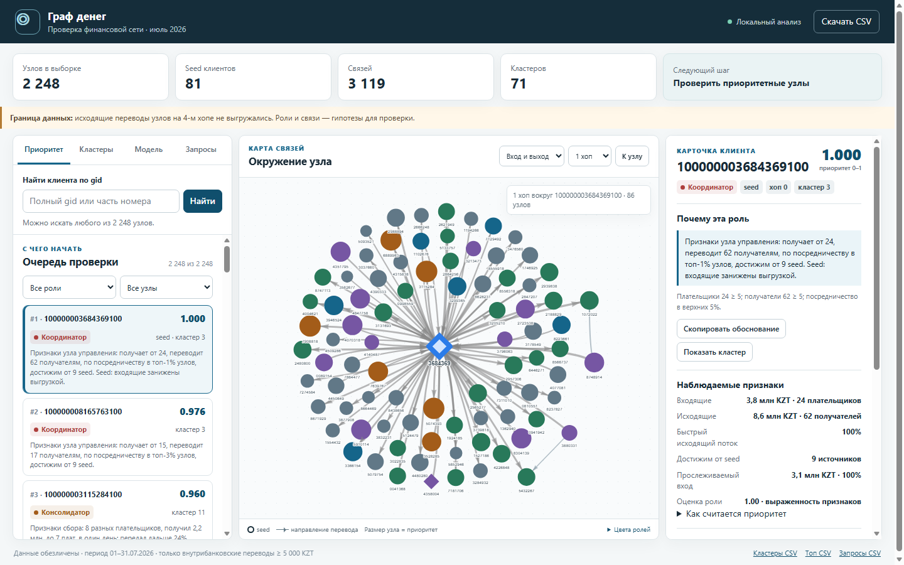

# Граф денег

Локальная система HackAlem AI для исследования сети переводов. Аналитик загружает три Parquet-файла, сервер проверяет данные и рассчитывает роли, кластеры и приоритеты; веб-интерфейс показывает интерактивную схему и готовые выгрузки.

Полное описание метода, результатов и ограничений: [money_graph/README.md](money_graph/README.md).

В панели «Помощник» можно разобрать до пяти счетов, найти общих получателей и пути с подсветкой связей. Готовые действия работают без интернета; вопросы своими словами доступны после настройки OpenAI API. [Подключение и ограничения](money_graph/README.md#помощник-по-выбранным-счетам).

Весь рабочий проект находится в `money_graph/`: расчёт, данные, исходники интерфейса и готовые выгрузки.



## Запуск веб-системы

Нужен Python 3.10 или новее. Из корня репозитория:

```powershell
cd money_graph
python -m pip install -r requirements.txt
python manage_users.py bootstrap --username admin  # только при первом запуске
python -m uvicorn server:app --host 127.0.0.1 --port 8765
```

Откройте **http://127.0.0.1:8765**. При первом запуске временные данные входа находятся в `money_graph/.local/admin-onboarding.txt`; после входа приложение предложит сменить пароль. Данные из `money_graph/data/` доступны как демонстрационный кейс. Кнопка «Загрузить данные» принимает `nodes.parquet`, `edges.parquet` и `transactions.parquet` по схеме [описания данных](money_graph/data/README.md). Новые кейсы, документы и отчёты доступны только своему аккаунту и сохраняются локально в `money_graph/.local/`, вне Git.

## Воспроизводимый расчёт по ТЗ

Из папки `money_graph/` выполните `python run.py`, затем `python check.py`. Один запуск создаёт `out/nodes_roles.csv`, `out/clusters.csv`, `out/top_nodes.csv` и автономный `out/viewer.html`. Сервер для этого расчёта не нужен.

Расчёт меток учитывает порядок дней и доступные суммы; поступления одного дня не считаются доказанным продолжением цепочки. В карточке видны составляющие приоритета, в модели — её допущения.

Проверки из корня репозитория: `python -m pip install -r requirements-dev.txt`, затем `python -m pytest -q`. Тесты выполняют свежий полный расчёт и не обращаются к OpenAI.
