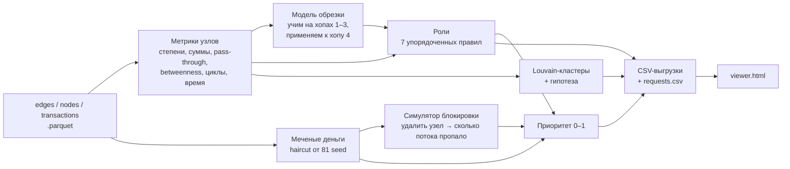

# hack-61c5ca4c-orbit-digital-ako
# Граф денег

**Восстановление финансовой структуры организованной группы по транзакционной сети**

HackAlem AI · трек «Аналитика и принятие решений / Кибербезопасность и комплаенс»

Правоохранительные органы знают 81 клиента — нижний уровень цепочки («курьеров»). Инструмент берёт выгрузку их исходящих переводов на 4 хопа (2 248 клиентов), назначает каждому роль с объяснением в цифрах, делит сеть на кластеры и отвечает на вопрос аналитика:

> **Кого из 2 248 клиентов проверять первым и почему?**


> Все выводы инструмента — **гипотезы для проверки** («признаки консолидации»), а не утверждения о вине.

---

## Главный результат

Блокировка **20 узлов из 2 248**, выбранных инструментом, убирает **57%** денег, прослеживаемых к seed-клиентам. Блокировка 20 случайных узлов убирает **2%**.

| Заблокировано узлов | Остаётся потока — топ-N по приоритету | Остаётся — N случайных (среднее из 20) |
|---|---|---|
| 5 | 83% | 99% |
| 10 | 78% | 98% |
| 20 | **43%** | **98%** |

Фокус проверки смещается с 81 «курьера» на реальные точки сбора и управления. Топ-1 оказался seed-клиентом, который получает деньги от 24 участников сети и переводит 62 получателям: это не курьер, а центр.


---

## Быстрый старт

Нужен Python 3.9+.

```bash
git clone <URL-репозитория>
cd money_graph
pip install -r requirements.txt
```

Положите три файла из архива организаторов в папку `data/` (в репозиторий они не входят по условиям лицензии):

```
data/
├── edges.parquet
├── nodes.parquet
└── transactions.parquet
```

Запуск — **одна команда**:

```bash
python run.py        # data/ → out/, ~8 секунд на ноутбуке
python check.py      # проверка выгрузок на соответствие схеме ТЗ → OK
```

Откройте `out/viewer.html` в браузере. Файл работает **полностью офлайн**: библиотека графа встроена.

Параметры `run.py`: `--data <папка>`, `--out <папка>`, `--config config.json`, `--llm` (опционально, см. [LLM](#опционально-llm)).

---

## Соответствие ТЗ

| № | Обязательное требование | Где выполнено | Проверка |
|---|---|---|---|
| 1 | Воспроизводимый пайплайн, < 5 мин, 3 файла | `python run.py` | ~8 с, создаёт все выгрузки |
| 2 | Роль, score, evidence у всех 2 248 узлов | `out/nodes_roles.csv` | `check.py`: 2 248 строк, без пропусков, evidence ≤ 200 символов с числами |
| 3 | Документированные критерии ролей | [Роли](#роли-правила-и-пороги), `config.json` | каждое правило — формула с порогом |
| 4 | Кластеризация с гипотезами | `out/clusters.csv` | 71 кластер, `cluster_id` у каждого узла |
| 5 | Топ ≥ 20 + карта сети | `out/top_nodes.csv`, `out/viewer.html` | топ-30; стрелки, роли, поиск по gid |

| Опциональный пункт | Статус |
|---|---|
| Учёт обрезки графа на 4-м хопе | ✅ роль `truncated` + модель вероятности перевода дальше |
| Временные паттерны | ✅ быстрый транзит (≤ 2 дней), синхронные поступления в один день |
| Возвратные потоки | ✅ циклы длиной ≤ 4, переводы обратно seed-клиентам |
| Оценка устойчивости сети | ✅ симулятор блокировки, `resilience.csv` |
| Карточка узла | ✅ во вьюере |
| Оценка полноты данных | ✅ `requests.csv` — что запросить дальше |

---

## Что на выходе

| Файл | Содержимое |
|---|---|
| `nodes_roles.csv` | 2 248 строк: `gid, role, role_score, cluster_id, priority_score, evidence` + `role_base` и все метрики, на которых построена роль |
| `clusters.csv` | `cluster_id, n_nodes, n_seed, sum_kzt_internal, top_gids, hypothesis` |
| `top_nodes.csv` | топ-30: `rank, gid, role, priority_score, why` |
| `requests.csv` | 559 запросов для закрытия слепых зон |
| `resilience.csv` | устойчивость сети при блокировке топ-N против N случайных |
| `summary.json` | сводка, качество модели обрезки, время прогона |
| `viewer.html` | экран просмотра |

---

## Схема решения



---

## Ключевая идея: «меченые деньги» и симулятор блокировки

**Меченые деньги (haircut-метод, применяется в AML).** Каждому seed-клиенту приписывается доля 1,0 «меченых» денег. Каждый узел передаёт дальше ту же долю меченых денег, какая была среди полученного им, пропорционально суммам рёбер (8 итераций, циклы учитываются). Для любого узла получается понятная аналитику фраза: «из полученных 2,2 млн 1,7 млн (72%) прослеживаются к seed-клиентам». Всего в сети прослеживается **253,1 млн KZT** из 365,9 млн оборота.

**Симулятор блокировки.** Для каждого узла: удалить его из графа, заново пропустить меченые деньги, посчитать, какая доля всего меченого потока исчезла. Это прямой ответ на вопрос «что изменится, если проверить этот счёт». Метрика входит в приоритет с весом 0,25 и показывается в карточке узла.

---

## Роли: правила и пороги

Правила проверяются **по порядку**, срабатывает первое. Все пороги лежат в `config.json`. Уверенность `role_score` растёт от 0,5 на пороге до 1,0 при двукратном превышении.

| № | Роль | Правило | Узлов |
|---|---|---|---|
| 0 | `peripheral` | нет ни одного ребра (seed без переводов ≥ 5 000 KZT) | 19 |
| 1 | `truncated` *(расширение словаря)* | хоп 4 и нет исходящих — исходящие **не выгружались** | 444 |
| 2 | `coordinator` | ≥ 5 плательщиков **и** ≥ 5 получателей **и** betweenness в топ-5% | 17 |
| 3 | `distributor` | ≥ 10 получателей и получателей в 3+ раза больше, чем плательщиков | 46 |
| 4 | `consolidator` | ≥ 4 разных плательщиков (уверенность выше, если передал дальше ≤ 50%) | 67 |
| 5 | `transit` | не seed; передал 70–130% полученного **или** ≥ 70% исходящей суммы ушло в течение 2 дней после поступления | 154 |
| 6 | `terminal` | нет исходящих на **полностью выгруженном** хопе 0–3; получил ≥ 100 тыс. или от ≥ 2 плательщиков | 358 |
| 7 | `peripheral` | всё остальное | 1 143 |

Колонка `role_base` дублирует роль строго в словаре ТЗ (`truncated` → `peripheral`) для механической проверки схемы.

### Примеры evidence

| gid | Роль | evidence |
|---|---|---|
| 100000003684369100 | coordinator | Признаки узла управления: получает от 24, переводит 62 получателям, по посредничеству в топ-1% узлов, достижим от 9 seed. Seed: входящие занижены выгрузкой. |
| 100000008258083100 | transit | Признаки транзита: получил 3,1 млн, передал 65%; 76% ушло в течение 2 дней после поступления, медианная задержка 0 дн |
| 100000002605308100 | terminal | Деньги оседают: получил 2,6 млн от 3 плат., исходящих ≥5 000 KZT нет (хоп 2 выгружен полностью). |
| 100000002126791100 | truncated | Обрезан на 4-м хопе: исходящие не выгружались. Получил 1,3 млн от 1 плат.; оценка P(переводит дальше)=35%. |

---

## Как учтены особенности данных

| Особенность | Решение |
|---|---|
| **Обрезка на 4-м хопе.** 444 узла без исходящих — артефакт обхода | Роль `truncated`, а не `terminal`. На 1 723 полностью видимых узлах хопов 1–3 обучена логистическая регрессия (число плательщиков, log суммы входа, дней до конца июля) и применена к хопу 4. **AUC = 0,66** на 5-кратной CV — умеренно, поэтому оценка `p_onward` не меняет роль, а задаёт порядок запросов на 5-й хоп. Главный признак: узлы с 3+ плательщиками переводят дальше в 75% случаев против 33% |
| **Заниженный вход у seed** | Для seed `pass_through` не используется ни в одном правиле; в evidence пометка «входящие занижены выгрузкой» |
| **Невидимые поступления.** 354 узла отправили больше, чем получили | Evidence пишет прямо: «передал в 3,8 раза больше полученного (есть невидимые поступления извне)» |
| **Порог 5 000 KZT** | Дробление ниже порога невидимо — вынесено в ограничения и в `requests.csv` |
| **31 seed без исходящих, 19 без рёбер вообще** | Все попадают в выгрузку; 19 узлов без рёбер — кластер 0; для 31 seed сформирован запрос |
| **16 слабосвязных компонент** | Учтены в кластерах и в кривой устойчивости |
| **Сумма ≠ количество переводов** | Правила используют число контрагентов, суммы, число транзакций и даты |
| **Направленный граф** | Роли, betweenness, меченые деньги и блокировка — на направленном графе. Louvain — на неориентированной проекции: для группировки важна плотность связей, направление учтено в ролях |

---

## Приоритет

`priority_score` — взвешенная сумма перцентильных рангов, нормированная к 0–1:

| Компонента | Вес | Смысл |
|---|---|---|
| Меченые деньги на входе | 0,25 | сколько прослеживаемых к seed денег получил |
| Эффект блокировки | 0,25 | какая доля меченого потока исчезнет |
| Вес роли | 0,20 | координатор 1,0 → консолидатор 0,9 → распределитель 0,8 → транзит 0,6 → обрезан 0,4 → терминал 0,3 → периферия 0 |
| Betweenness | 0,10 | сколько маршрутов идёт через узел |
| Число seed-источников | 0,10 | от скольких seed доходят деньги |
| Оборот | 0,10 | вход + выход |

**Топ-5:**

| # | gid | Роль | Приоритет |
|---|---|---|---|
| 1 | 100000003684369100 | coordinator | 1,000 |
| 2 | 100000008165763100 | coordinator | 0,976 |
| 3 | 100000003115284100 | consolidator | 0,960 |
| 4 | 100000000331309100 | coordinator | 0,957 |
| 5 | 100000000437046100 | coordinator | 0,956 |

---

## Кластеры

Louvain с фиксированным `seed=42` — результат воспроизводится. 71 кластер; в **9** из них больше одного seed-клиента — кандидаты в ядро группы. Гипотеза собирается правилом из состава ролей, например:

> Контур сбора: 2 коорд. и 4 консолид. стягивают средства 5 seed; кандидат в ядро группы; 11 транзитных счетов — признаки цепочек проводки. Внутр. оборот 19,6 млн.

---

## Что запросить дальше (`requests.csv`)

| Тип | Кол-во | Что запросить |
|---|---|---|
| `next_hop_outgoing` | 444 | исходящие 5-го хопа; порядок по `p_onward × меченые деньги` |
| `incoming_external` | 84 | для координаторов и консолидаторов — входящие вне выборки и межбанк |
| `seed_no_outgoing` | 31 | seed без исходящих ≥ 5 000: межбанк, наличные, дробление ниже порога |

---

## Как за минуту объяснить роль любого gid

1. Открыть `out/viewer.html` → вкладка **«Поиск gid»** → ввести gid.
2. Карточка узла показывает роль, evidence, все метрики правила, меченые деньги, эффект блокировки, крупнейших контрагентов.
3. Сверить метрику с порогом из таблицы [ролей](#роли-правила-и-пороги).

Пример: `100000003684369100` — seed; 24 плательщика ≥ 5 и 62 получателя ≥ 5, по посредничеству в топ-1% → `coordinator`. Блокировка убирает 5,8% всего меченого потока.

---

## Опционально: LLM


## Ограничения

- Нет разметки ролей, поэтому пороги подобраны по распределениям данных и задокументированы, а не обучены.
- Переводы < 5 000 KZT и межбанк не видны: дробление и внешние каналы — слепая зона.
- Входящие из-за пределов выборки не видны, баланс узла неполный.
- Модель обрезки даёт умеренное качество (AUC 0,66) и используется только для очерёдности запросов.
- Louvain стохастичен; `seed` фиксирован, но при другой версии networkx состав кластеров может немного отличаться.

---

## Масштабирование до ~1 млн узлов

- networkx → **igraph** или **graph-tool**; хранение в **DuckDB/Parquet** или **Neo4j**.
- Меченые деньги уже векторные (`numpy.bincount`); на миллионе узлов — разреженное умножение матриц (`scipy.sparse`), секунды на итерацию.
- Симулятор блокировки O(N·E) — считать только для топ-1 000 кандидатов или через доминаторы графа потоков.
- Betweenness — приближённая по выборке источников; Louvain → **Leiden**.
- Циклы — только внутри кластеров с ограничением длины.
- Инкрементальный пересчёт при догрузке новых хопов вместо полного.

---

## Структура репозитория

```
├── run.py              одна команда: parquet → все выгрузки
├── check.py            проверка выгрузок на схему ТЗ
├── config.json         все пороги и веса
├── requirements.txt
├── mg/
│   ├── features.py     метрики: структура, суммы, время, seed, циклы
│   ├── taint.py        меченые деньги, блокировка, устойчивость
│   ├── cutoff.py       модель для обрезанных 4-м хопом узлов
│   ├── roles.py        правила ролей и evidence
│   ├── clusters.py     Louvain и гипотезы кластеров
│   ├── viewer.py       офлайн-экран просмотра
│   └── llm.py          опциональная LLM-переформулировка гипотез
├── out/                готовые выгрузки и viewer.html
├── docs/               скриншоты
├── vendor/             vis-network 9.1.9 для офлайн-вьюера
├── starter/            стартовый код организаторов (в пайплайне не используется)
└── data/               parquet-файлы — НЕ в репозитории (.gitignore)
```

## Стек


## Данные и приватность

Данные обезличены (gid — синтетический идентификатор) и предоставлены только для использования в рамках хакатона, поэтому в репозиторий не включены. Решение не использует и не предполагает ФИО, ИИН или другие персональные данные.

Hackathon team repository for Orbit Digital | AKO
