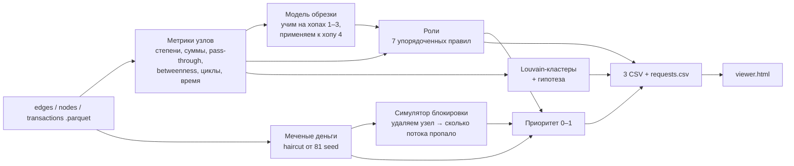

# Граф денег — кто выше «курьеров»

Инструмент для AML-аналитика: по выгрузке переводов 81 клиента на 4 хопа строит граф, назначает каждому из 2 248 узлов роль с объяснением в цифрах, делит сеть на кластеры и отвечает на вопрос **«кого из 2 248 клиентов смотреть первым и почему»**.

Все выводы — **гипотезы для проверки** («признаки консолидации»), а не утверждения о вине.

## Запуск

Нужен **Python 3.10+**. Перейдите в папку `money_graph/` и установите зависимости:

```bash
python -m pip install -r requirements.txt
```

### Рабочая веб-система

```bash
python manage_users.py bootstrap --username admin  # только при первом запуске
python -m uvicorn server:app --host 127.0.0.1 --port 8765
```

Первый пароль записывается в `.local/admin-onboarding.txt`, не в Git. Войдите как `admin`, смените временный пароль и удалите файл с ним. Во вкладке «Пользователи» администратор выдаёт учётные записи аналитикам. Публичной регистрации нет. Загруженные кейсы доступны только владельцу, включая граф, транзакции, документы и выгрузки; администратор не получает доступа к чужим кейсам. Демо-набор HackAlem общий для вошедших пользователей, но заметки, документы и отчёты даже по демо личные. Сессии отзываются при выходе, смене пароля и отключении аккаунта.

Рабочий сценарий: **Расследование → «В отчёт» → сохранить версию → открыть/скачать документ со схемой и основаниями**. Отчёт можно распечатать в PDF из браузера; также доступны Markdown и JSON. Поиск оснований по кейсу и личным TXT/MD работает локально с источниками, **без подключённой LLM**. Режим разработчика показывает ограничения и состояние поиска; это не заявление о готовом генеративном RAG. Подробнее: [PLATFORM.md](docs/PLATFORM.md), [WORKSPACE.md](docs/WORKSPACE.md).

Откройте `http://127.0.0.1:8765`. Демо-кейс использует приложенные данные. Для нового анализа нажмите «Загрузить данные», укажите название, порог суммы выгрузки и три Parquet-файла. Система проверяет поля, уникальность gid и рёбер, ссылки на узлы, суммы и количество транзакций, затем запускает тот же расчёт и показывает новый кейс. Даты периода и число узлов определяются из данных. Схема входа и метод обхода остаются такими, как в ТЗ: seed и исходящие переводы до четырёх хопов. Результаты отдельных кейсов находятся в `.local/cases/` и исключены из Git.

На схеме можно искать gid, переходить по связям, менять направление и глубину окружения, раскрывать соседей, скрывать узлы, перетаскивать и закреплять их. Параметры спрятаны в «Настроить схему»; оформление — в отдельном раскрываемом блоке. Позиции хранятся только в памяти текущего входа и очищаются при выходе. Стрелки показывают направление переводов, цвет и форма — назначенную роль, рамка — seed. Веб-система привязана к `127.0.0.1`; наличие входа не делает её готовой к публичному размещению или обработке реальных банковских данных. Для развёртывания нужны HTTPS, управление секретами, резервирование, проверка прав ОС и независимая проверка безопасности.

Граница сбора задаётся параметром `max_depth` в `config.json` или в форме загрузки; значение по ТЗ — 4. Она не выводится из максимального хопа, встретившегося в файлах. Иначе небольшой граф мог бы ошибочно превратить конечных получателей в обрезанные узлы. Порог суммы также указывается при загрузке. Параметры расчёта нового кейса сохраняются рядом с его данными.

В текущем интерфейсе списки доступны полностью через поиск и страницы. Одновременно на схеме можно показать 40, 100 или 220 узлов; CSV всегда содержит все узлы. Щелчок выбирает узел без изменения схемы, двойной щелчок открывает его окружение. Щелчок по стрелке или связи в карточке запрашивает исходные транзакции у сервера с датами, суммами и страницами. Раздел «Правило назначения роли» объясняет пороги. Клавиши ←/→ переключают вкладки, Escape закрывает диалог или сворачивает схему.

### Расчёт без сервера по ТЗ

Выполните полный пересчёт одной командой и проверьте выгрузки на соответствие схеме ТЗ:

```bash
python run.py            # data/ → out/
python check.py          # проверка выгрузок на соответствие схеме ТЗ → печатает "OK"
```

Затем откройте `out/viewer.html` в браузере. Файл полностью офлайн: библиотека графа и данные встроены, интернет не нужен. Три входных файла лежат в `data/`; их схема описана в [data/README.md](data/README.md). Если Windows консоль неверно показывает кириллицу в журнале, перед запуском в PowerShell задайте `$env:PYTHONIOENCODING = 'utf-8'`.

Входные файлы содержат обезличенные идентификаторы, даты и суммы транзакций. `out/viewer.html` включает весь граф, поэтому доступ к нему и к `data/` следует предоставлять только участникам анализа и жюри. Локальная HTML-страница не отправляет данные в сеть; при передаче файла получатель получает встроенные данные целиком.

Параметры: `--data <папка с parquet>`, `--out <папка выгрузок>`, `--config config.json`.

Требования ТЗ для приложенного датасета проверяются командой `python check.py`; она рассчитана на известные 2 248 узлов. Для других кейсов проверка входа и расчёт выполняются сервером, а число выходных строк равно числу загруженных узлов.

## Интерфейс аналитика

На главном экране — очередь проверки и направленная схема, под ней краткое основание выбранного клиента. Полная карточка, сводка, настройки и модельный сценарий раскрываются по необходимости. На телефоне схема и очередь переключаются, а выбор клиента открывает его окружение. Отчёты, документы и административные функции вынесены в отдельные разделы. Поиск работает по полному или частичному gid и охватывает все 2 248 узлов. Старый снимок `docs/ui-overview.png` относится к предыдущей версии интерфейса.

Рабочий интерфейс находится в `web/` и получает данные через локальный API `server.py`. Автономный экран для обязательной поставки по ТЗ находится в `ui/`; `mg/viewer.py` встраивает его в один HTML при запуске пайплайна. Все gid передаются в браузер как строки, чтобы сохранить точность идентификаторов.

## Что на выходе

| Файл | Содержимое |
|---|---|
| `nodes_roles.csv` | 2 248 строк; `role` строго из шести значений стартового словаря. `role_detail` и `is_truncated` отдельно обозначают обрезку выборки; `role_base` оставлена для совместимости. Также scores, кластер, evidence и метрики |
| `clusters.csv` | 71 кластер: `cluster_id, n_nodes, n_seed, sum_kzt_internal, top_gids, hypothesis` |
| `top_nodes.csv` | топ-30: `rank, gid, role, priority_score, why` |
| `requests.csv` | что запросить дальше, чтобы закрыть слепые зоны (559 запросов трёх типов) |
| `resilience.csv` | что станет с сетью при блокировке топ-N узлов против N случайных |
| `summary.json` | сводка, качество модели обрезки, время прогона |
| `viewer.html` | экран просмотра: топ-список, поиск по gid, кластеры, симулятор блокировки, карточка узла |

## Схема решения



## Главная идея: «меченые деньги» и симулятор блокировки

**Модель помеченного потока.** Seed задают начальные источники метки. Пропорциональное распространение по агрегированным рёбрам имеет фиксированный горизонт в 8 итераций, а не доказанную сходимость. Доля помеченного входа в объяснении считается как помеченный вход / наблюдаемый вход; принудительная исходная метка seed не подставляется вместо неё. Сумма около **253 млн KZT** — модельный оборот по рёбрам, не уникальная сумма денег: одни средства могут учитываться повторно по пути. См. [точные определения и ограничения](docs/MODEL-LIMITS.md).

**Симулятор блокировки.** Для каждого узла удаляем его из графа, заново пропускаем меченые деньги и считаем, какая доля всего меченого потока исчезла. Это прямой ответ на вопрос «что изменится, если проверить этот счёт». Результат на данных:

| Заблокировано | Остаётся меченого потока (топ-N по приоритету) | Остаётся (N случайных, среднее из 20) |
|---|---|---|
| 5 | 83% | 99% |
| 10 | 78% | 98% |
| 20 | 43% | 98% |

В этом модельном сценарии исключение топ-20 меняет поток сильнее, чем случайное исключение. Это не независимая оценка точности ролей или реального эффекта блокировки: компонент эффекта исключения уже участвует в ранжировании. Без разметки нельзя заявлять доказанную точность AML-выявления.

## Роли: правила и пороги

Правила проверяются по порядку, срабатывает первое. Все пороги в `config.json`. Уверенность `role_score` растёт от 0,5 на пороге до 1,0 при двукратном превышении.

| № | Роль | Правило | Узлов |
|---|---|---|---|
| 0 | `peripheral` | нет ни одного ребра (19 seed без переводов ≥5 000) | 19 |
| 1 | `truncated` *(внутренний статус / role_detail)* | хоп 4 и нет исходящих: исходящие **не выгружались**; в обязательной `role` записывается `peripheral`, отдельно `is_truncated=true` | 444 |
| 2 | `coordinator` | ≥5 плательщиков **и** ≥5 получателей **и** betweenness в топ-5% | 17 |
| 3 | `distributor` | ≥10 получателей и получателей в 3+ раза больше, чем плательщиков | 46 |
| 4 | `consolidator` | ≥4 разных плательщиков (уверенность выше, если передал дальше ≤50%) | 67 |
| 5 | `transit` | не seed, есть вход и выход, и либо передал 70–130% полученного, либо ≥70% исходящей суммы ушло в течение 2 дней после поступления | 154 |
| 6 | `terminal` | нет исходящих на **полностью выгруженном** хопе 0–3, и получил ≥100 тыс или от ≥2 плательщиков | 358 |
| 7 | `peripheral` | всё остальное | 1 143 |

Почему статус `truncated`, а не `terminal`: у 444 узлов на 4-м хопе исходящие не собирались, и назвать их «деньги осели» было бы ошибкой. `terminal` описывает отсутствие исходящих только в наблюдаемом периоде, до границы обхода и с указанным порогом сумм, а не в реальной сети вообще.

## Учёт особенностей данных

**Обрезка на 4-м хопе.** У узлов хопов 1–3 исходящие выгружены полностью, поэтому для них известно, переводили ли они дальше. На 1 723 таких узлах обучена логистическая регрессия из трёх признаков (число плательщиков, log суммы входа, дней от последнего поступления до конца июля) и применена к 444 обрезанным узлам. Качество честно умеренное: **AUC = 0,66** на 5-кратной кросс-валидации, базовая доля «переводит дальше» 37%. Главный признак — число плательщиков: узлы с 3+ плательщиками переводили дальше в 75% случаев против 33% у узлов с 1–2 плательщиками. Оценка `p_onward` не меняет роль, а задаёт порядок запросов на выгрузку 5-го хопа.

**Заниженный вход у seed.** Для seed-клиентов `pass_through` не используется ни в одном правиле, в evidence добавляется пометка «входящие занижены выгрузкой».

**Невидимые поступления.** 354 узла отправили больше, чем получили в выборке. Evidence пишет это явно: «передал в 3,8 раза больше полученного (есть невидимые поступления извне)».

**Суммы против количества.** В правилах используются число контрагентов, суммы и число транзакций. `fast_share` — временная близость исходящих к поступлениям, не сопоставление конкретных денег. Суммы поступлений не распределяются между исходящими, а дата без времени не доказывает порядок операций внутри дня.

**Направление.** Роли, betweenness, меченые деньги и блокировка считаются на направленном графе. Louvain работает на неориентированной проекции (вес = сумма в обе стороны); это оговорено сознательно: для группировки важна плотность связей, направление учтено в ролях.

**Разрывы сети.** 16 слабосвязных компонент; 19 seed без рёбер вынесены в кластер 0 с гипотезой «нужен запрос».

## Приоритет

`priority_score` — взвешенная сумма перцентильных рангов, нормированная к 0–1:

| Компонента | Вес | Смысл |
|---|---|---|
| меченые деньги на входе | 0,25 | сколько прослеживаемых к seed денег получил |
| эффект блокировки | 0,25 | какая доля меченого потока исчезнет |
| вес роли | 0,20 | координатор 1,0 → консолидатор 0,9 → распределитель 0,8 → транзит 0,6 → обрезан 0,4 → терминал 0,3 → периферия 0 |
| betweenness | 0,10 | сколько маршрутов идёт через узел |
| число seed-источников | 0,10 | от скольких seed до узла доходят деньги |
| оборот | 0,10 | вход + выход |

## Кластеры

Louvain с фиксированным `seed=42` (результат воспроизводится). 71 кластер; в 9 из них больше одного seed-клиента, это кандидаты в «ядро» группы. Гипотеза собирается правилом из состава ролей: «Контур сбора: 2 коорд. и 4 консолид. стягивают средства 5 seed; кандидат в ядро группы; 11 транзитных счетов — признаки цепочек проводки».

## Что запросить дальше (`requests.csv`)

Отдельный вывод об оценке полноты данных:

- `next_hop_outgoing` (444): выгрузить исходящие 5-го хопа, порядок по `p_onward × меченые деньги`;
- `incoming_external` (84): для координаторов и консолидаторов выгрузить входящие вне выборки и межбанковские;
- `seed_no_outgoing` (31): seed без исходящих ≥5 000 — проверить межбанк, наличные и дробление ниже порога.

## Как за минуту объяснить роль любого gid

Открыть `viewer.html` → «Поиск gid» → карточка узла показывает роль, evidence, все метрики правила и крупнейшие входящие/исходящие. Пример: `100000003684369100` — seed, получает от 24 и переводит 62 получателям, по посредничеству в топ-1% → `coordinator`; блокировка убирает 5,8% всего меченого потока.

## Ограничения

- Нет разметки ролей, поэтому пороги подобраны по распределениям данных и описаны явно, а не обучены.
- Переводы <5 000 KZT и межбанк не видны: дробление сумм и внешние каналы — слепая зона.
- Входящие из-за пределов выборки не видны, поэтому баланс узла неполный; `pass_through` > 1 трактуется как признак внешних поступлений.
- Модель обрезки даёт умеренное качество (AUC 0,66) и используется только для очерёдности запросов.
- Louvain стохастичен; `seed` фиксирован, но при изменении данных состав кластеров может сдвигаться.

## Масштабирование до ~1 млн узлов

- networkx → igraph или graph-tool (C/C++); хранение графа в DuckDB/Parquet или Neo4j.
- Меченые деньги — уже векторные `bincount`; на миллионе узлов это разреженное умножение матрицы (scipy.sparse), секунды на итерацию.
- Симулятор блокировки: полный перебор O(N·E) не масштабируется → считать только для топ-1000 кандидатов по остальным компонентам приоритета или оценивать через доминаторы в графе потоков.
- Betweenness — приближённая по выборке k источников; Louvain → Leiden.
- Циклы искать только внутри кластеров с ограничением длины.
- Инкрементальный пересчёт при догрузке новых хопов вместо полного.

## Структура

```
run.py              одна команда: parquet → выгрузки
server.py           локальный API кейсов, загрузки, транзакций и CSV
web/                рабочий веб-интерфейс, подключённый к API
mg/validation.py    проверка схемы и согласованности входных данных
config.json         все пороги и веса
mg/features.py      метрики: структура, суммы, время, seed, циклы
mg/taint.py         меченые деньги, блокировка, устойчивость
mg/cutoff.py        модель для обрезанных 4-м хопом узлов
mg/roles.py         правила ролей и evidence
mg/clusters.py      Louvain и гипотезы кластеров
mg/viewer.py        офлайн-экран просмотра
ui/                 исходники HTML, CSS и JavaScript интерфейса
data/               входные parquet и описание схемы
out/                обязательные CSV, дополнительные выгрузки и автономный viewer.html
docs/               снимок экрана для знакомства с проектом
vendor/             vis-network 9.1.9 (Apache-2.0/MIT) для офлайн-вьюера
starter/            стартовый код организаторов (не используется в пайплайне)
```

## Дальнейшая работа

Для локальной демонстрации система готова. Перед общим использованием командой нужны учётные записи, права доступа к кейсам, HTTPS и журнал действий. Длительные расчёты следует перенести в сохраняемую очередь заданий с прогрессом и восстановлением после перезапуска. Для больших графов потребуется серверная выдача подграфов и постраничные запросы вместо передачи всего графа браузеру. Критерии ролей и порядок проверки нужно оценить с AML-аналитиком: без размеченных ролей нельзя заявлять измеренную точность классификации.
