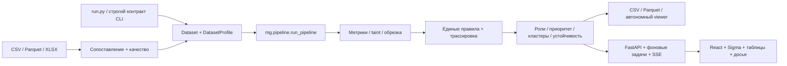

# Граф денег · локальная платформа расследований

Приложение принимает пользовательские таблицы, рассчитывает объяснимые роли и помогает исследовать связи. Аналитический расчёт выполняется на вашем компьютере. Интерфейс использует React / TypeScript, Sigma.js / graphology, TanStack Query / Table / Virtual, Recharts, Radix Dialog, Tailwind, Zustand, i18next и локальный Inter.

## Быстрый запуск

```powershell
python -m pip install -r requirements.txt
python serve.py
```

Откройте **http://127.0.0.1:8000**. Кнопка **«Открыть пример»** создаёт проект из `data/` и запускает расчёт. **«Новый анализ»** открывает мастер загрузки. Сборка `web/dist/` включена в репозиторий: Node.js при обычном запуске не требуется. Установка Python-зависимостей требует доступного пакетовому менеджеру источника; после установки приложение работает без интернета.

Для разработки интерфейса:

```powershell
cd web
npm ci
npm run dev
# После изменений:
npm run build
```

Vite перенаправляет `/api` на локальный сервер порта 8000. В репозиторий включаются исходники, lock-файл и готовый `dist/`.

## Обязательная поставка хакатона

```powershell
python run.py
python check.py
```

В `out/` создаются `nodes_roles.csv`, `clusters.csv`, `top_nodes.csv`, `requests.csv`, `resilience.csv`, `summary.json`, `nodes.parquet` и автономный `viewer.html`. `check.py` проверяет именно исходную схему и 2 248 узлов хакатона. Для пользовательских проектов действует универсальная проверка качества.

Параметры CLI: `--data`, `--out`, `--config`. Числовые идентификаторы в CLI CSV сохраняются как int64, если преобразование обратимо; в аналитическом ядре, API и браузере все идентификаторы — строки.

Эталонный метод и исходные предпосылки описаны в [BASELINE_METHOD.md](docs/BASELINE_METHOD.md). Эта архивная записка отражает первый набор данных; её старые команды веб-запуска заменены командами выше.

## Загрузка своих данных

Мастер: **файлы → колонки → параметры → качество → расчёт**.

Поддерживаются:

- CSV: UTF-8 / UTF-8 BOM / Windows-1251, разделители запятая, точка с запятой, табуляция, `|`;
- Parquet;
- XLSX: выбор листа, без выполнения формул или макросов.

До 20 файлов на проект, по умолчанию до 500 МБ каждый; `upload_limit_mb` настраивается в `config.json`. Имена файлов служат подписями; на диске используются случайные идентификаторы.

| Таблица | Поля | Требование |
|---|---|---|
| Транзакции | `src`, `dst`, `amount`, `date` | Нужна эта таблица или агрегированные связи; дата необязательна |
| Связи | `src`, `dst`, `amount`, `n_tx` | При наличии транзакций пересчитываются из них |
| Узлы | `id`, `depth`, `is_seed` | Необязательна; отсутствующие узлы строятся из связей |
| Seed | `id` | Необязательный отдельный файл; также доступны флаг или ввод списка |

Автопредложение колонок использует русские и английские синонимы, затем типы значений. Оно **не запускает анализ без подтверждения**. Показаны уверенность, исходные строки и результат преобразования. Суммы вида `1 234,50` поддерживаются. Для неоднозначных дат можно выбрать порядок дня и месяца.

В параметрах задаются валюта, известный порог сбора, известная граница обхода, seed и язык evidence. Вычисленная BFS-глубина сама по себе **не означает границу выгрузки**: максимальный хоп сбора нужно указать явно, иначе правило обрезки выключено.

Проверяются пропуски, дубли, петли, суммы, даты, согласованность связей с транзакциями, изолированные seed, компоненты и доля обрезки. Более 5% строк без src/dst/amount блокируют расчёт. При меньшей доле строки исключаются с предупреждением. Отрицательные и нулевые суммы исключаются с предупреждением: возвраты не интерпретируются автоматически как обратные переводы. Совпадающие транзакции сохраняются и требуют проверки аналитиком.

## Если данных не хватает

| Отсутствует | Поведение |
|---|---|
| Даты | Временные метрики отключены; транзит оценивается по соотношению сумм |
| Глубина, но есть seed | Направленный BFS от seed; граница сбора не предполагается |
| Глубина и seed | Обрезка не оценивается |
| Seed | Приоритет по структуре и оборотам, веса перенормированы; блокировка измеряет общий наблюдаемый поток |
| Не менее 100 обучающих узлов, оба класса или даты для модели обрезки | Модель не обучается, `p_onward` отсутствует, причина отображается |
| Даты части переводов | Временные метрики используют только датированные строки; обороты учитывают все допустимые строки |

Ограничения доступны в `summary.capabilities`, на обзоре и шаге качества. Роли являются признаками, которые аналитик должен проверять.

## Рабочие экраны

- **Обзор:** KPI, основной вывод, топ-10, роли, устойчивость к исключению узлов, ограничения.
- **Расследование:** фильтры, ограниченное окружение 1–3 хопа или мета-граф кластеров, синхронизированный инспектор, объяснение правил, переводы по ребру, шкала дат и проигрывание периода.
- **Фигуры:** геометрические формы ролей, пиктограммы или круги. Есть перемещение, закрепление, скрытие, масштабирование, мини-карта, новая раскладка, полный экран, PNG. До 3 000 узлов по явному запросу.
- **Узлы:** виртуальная таблица, серверная сортировка / пагинация / поиск, выбор колонок, сохранённый вид, массовое добавление в блокировку или дело. Ссылка сохраняет выбранный узел и фильтры.
- **Кластеры:** реальные мини-подграфы до 24 узлов, состав, гипотеза и переход к окружению.
- **Симуляция:** произвольный набор или топ-N, остаток потока, сравнение с 20 случайными наборами, компоненты и изменение кластеров. Sankey показывает общий эффект и атрибуцию поступлений от seed на наблюдаемые конечные узлы до/после. Поступления на конечные узлы отличаются от суммы оборота по всем рёбрам.
- **Правила:** абсолютные / адаптивные пороги, предварительный пересчёт ролей, изменившиеся узлы, нормируемые веса, пресет. Сохранение запускает полный расчёт. Предложения калибровки по обратной связи никогда не применяются автоматически.
- **Дело:** выбранные узлы, заметки, сценарии и HTML-досье. Досье привязано к сохранённой версии расчёта и содержит связи, evidence, трассировку, запросы, ограничения и конфигурацию. PDF: открыть досье → печать браузера → сохранить как PDF.

Языки интерфейса RU / ҚАЗ / EN, светлая и тёмная тема, системное предпочтение уменьшенной анимации. Основное рабочее место — настольный браузер; на мобильном доступен просмотр обзора и карточек.

### Горячие клавиши

| Клавиша | Действие |
|---|---|
| Ctrl/⌘+K или `/` | Поиск по части идентификатора |
| E | Раскрыть соседей выбранного узла |
| B | Добавить узел в симуляцию |
| A | Добавить узел в дело |
| Esc | Закрыть диалог / инспектор / полный экран |
| ? | Помощь и глоссарий |

Клавиши E/B/A работают вне полей ввода. Для выбора узла без мыши доступны поиск и таблица; вкладки инспектора поддерживают стрелки, Home/End.

## Архитектура



`mg/dataset.py` — нормализованные таблицы и вычисляемый профиль. `mg/ingest.py` — чтение файлов. `mg/quality.py` — качество. `mg/pipeline.py` — общее ядро без операций HTTP и записи файлов. `mg/explain.py` — условия правил как данные; тот же интерпретатор используется назначением ролей и трассировкой. `mg/i18n/` — шаблоны evidence / гипотез.

`api/storage.py` ограничивает пути папкой проекта, записывает JSON атомарно и хранит версии результатов. `api/jobs.py` — последовательный ThreadPoolExecutor и SSE. `api/main.py` — маршруты и раздача локальной статики. `server.py` — совместимый импорт приложения.

```
projects/<id>/
  project.json, mapping.json, config.json, quality.json, profile.json
  raw/                             исходные файлы
  nodes.parquet, edges.parquet, transactions.parquet
  current.json                     активная версия результатов
  results/<hash>/                   CSV, полные метрики, снимок данных и конфигурация
  feedback.json, cases.json
```

Кэш зависит от нормализованных данных, конфигурации и версии алгоритма. Одна задача на проект; изменение данных во время расчёта запрещено. Отмена применяется на границах этапов: уже выполняющаяся операция NetworkX завершается перед отменой. После перезапуска сервера завершённые проекты сохранены; незавершённую задачу нужно запустить заново. Отдельного внешнего сервиса очереди нет.

## API

**[OpenAPI / Swagger](http://127.0.0.1:8000/api/docs)**. Документация, JS и CSS Swagger поставляются локально.

Основные группы: `/api/projects`, `/files`, `/preview`, `/mapping`, `/quality`, `/run`, `/api/jobs/{id}/events`, `/summary`, `/nodes`, `/nodes/{id}/explain`, `/ego`, `/timeline`, `/clusters`, `/overview-graph`, `/network-graph`, `/paths`, `/simulate/block`, `/config/preview`, `/config`, `/feedback`, `/calibration`, `/cases`, `/export`. `/api/demo` создаёт копию исходного набора.

## Масштаб и ограничения

- Более 5 000 узлов: betweenness по 500 воспроизводимо выбранным источникам.
- Более 20 000 узлов: эффект отдельной блокировки оценивается для 1 000 кандидатов; у остальных `NaN`, а не нулевой эффект.
- Короткие циклы ограничены длиной 4 и количеством 100 000. Метрика при достижении лимита — нижняя оценка.
- Пути: ограниченный поиск до 12 переходов и 20 000 раскрытий, ранжирование по произведению долей потока. Это не доказательство происхождения конкретной денежной единицы.
- Louvain и приближённое посредничество остаются главными затратами на больших сетях. Результат `<5 минут` измерен на поставляемой синтетике, не является гарантией для произвольного плотного графа.
- Пороговые роли и haircut — исследовательские модели. Без размеченных данных нельзя заявлять измеренную точность ролей. AUC относится только к модели продолжения за границей выгрузки.

## Приватность

Сервер по умолчанию слушает только `127.0.0.1`; ограничены Host и Origin, внешние межсайтовые изменения запрещены. Основной анализ и локальные инструменты ассистента не отправляют данные наружу; нет CDN и телеметрии. Опциональные вопросы в OpenAI требуют отдельного подтверждения для каждого запроса. Логи HTTP с идентификаторами отключены в `serve.py`.

Пользовательские проекты исключены из Git. CSV защищены от формул Excel; текст в React и HTML-досье экранируется. Имена загрузок не используются как пути. Есть проверка расширения, размера и распакованного XLSX.

**Удаление проекта** удаляет его исходные файлы, версии расчётов, feedback и дела, а также состояние этого проекта в текущем браузере. Уже скачанные экспорты, снимки экрана, резервные копии и состояние другого браузера этим действием не удаляются. Данные на диске не шифруются приложением: используйте защищённую учётную запись ОС и шифрование диска. Приложение не предназначено для публикации порта в общей сети без отдельной аутентификации и разграничения доступа.

Автономный `viewer.html` и HTML-досье содержат встроенные данные. Передавайте их как чувствительные рабочие материалы.

## Ассистент из репозитория

Повторно используется `mg/assistant.py` из `origin/main`, коммит `ab08d0d`: объяснение узлов, общие получатели, направленный путь и запрос недостающих данных. Адаптер `api/assistant.py` передаёт ему версию расчёта выбранного проекта; идентификаторы остаются строками, валюта берётся из профиля. Ответ содержит проверяемые ссылки на узлы и связи и кнопку перехода на граф.

Локальные действия доступны сразу. Для вопросов на естественном языке:

```powershell
python -m pip install -r requirements-ai.txt
if (-not (Test-Path .env)) { Copy-Item .env.example .env }
```

Укажите `OPENAI_API_KEY` и при необходимости `OPENAI_MODEL` в локальном `.env`, затем перезапустите `python serve.py`. Ключ хранится на сервере, исключён из Git и не передаётся браузеру. Без настройки форма внешнего вопроса скрыта. Для каждого вопроса нужно подтвердить отправку в OpenAI вопроса, идентификаторов и результатов вызванных инструментов; исходные файлы целиком не отправляются. Ответы не изменяют роли, данные и правила. Произвольного выполнения кода и веб-поиска у ассистента нет.

Интеграция проверена локальными действиями и имитацией ответов провайдера. Вызов реального OpenAI не проверялся: ключ в этой среде не настроен.

В удалённой ветке также появилась другая, хронологическая модель движения денег и отдельная система пользователей/документов. Они не переносились в эту реализацию: текущий числовой эталон явно задан вашим ТЗ. Это выборочная интеграция ассистента, а не полное слияние `origin/main`. Для объединения моделей следует добавить отдельный режим, собственные эталонные тесты и сравнение результатов.

## Проверки

```powershell
python -m pip install -r requirements-dev.txt
python -m pytest ../tests tests -q
python run.py
python check.py
python tools/make_synthetic.py --big
python tools/benchmark.py --big
```

Браузерные проверки при работающем `python serve.py`:

```powershell
cd web
npm ci
npm run test:e2e
```

По умолчанию Playwright использует установленный Microsoft Edge. Для другого браузера задайте `PLAYWRIGHT_BROWSER` абсолютным путём к исполняемому файлу. В тестах создаются локальные тестовые проекты; их можно удалить из интерфейса. Большая синтетика и журналы проверки сохраняются в игнорируемой `.local/`.

[Результаты проверок и статус фаз](docs/VALIDATION.md).

## Снимки экранов

| Экран | Снимок |
|---|---|
| Проекты | [projects.png](docs/screens/projects.png) |
| Сопоставление | [mapping.png](docs/screens/mapping.png) |
| Качество | [quality.png](docs/screens/quality.png) |
| Обзор | [overview.png](docs/screens/overview.png) |
| Расследование | [investigate.png](docs/screens/investigate.png) |
| Узлы | [nodes.png](docs/screens/nodes.png) |
| Кластеры | [clusters.png](docs/screens/clusters.png) |
| Симуляция | [simulation.png](docs/screens/simulation.png) |
| Правила | [settings.png](docs/screens/settings.png) |
| Дело | [cases.png](docs/screens/cases.png) |
| Ассистент | [assistant.png](docs/screens/assistant.png) |
| Тёмная тема | [dark.png](docs/screens/dark.png) |
| Мобильный обзор | [mobile.png](docs/screens/mobile.png) |

## Следующие шаги

1. Независимая оценка гипотез и порогов аналитиками на размеченных данных; тесты на других плотностях сети и форматах банков.
2. Для нескольких пользователей: аутентификация, роли доступа, журнал изменений, шифрование и политика хранения, защищённый сетевой контур.
3. Для длительных расчётов: восстанавливаемая очередь процессов, отмена внутри этапа, ограничение ресурсов по проекту.
4. При необходимости включить внешний ассистент: настроить ключ, выбрать допустимые для передачи данные и проверить ответы на примерах аналитика. Для объединения с новыми модулями `origin/main` отдельно согласовать режим расчёта и перенести разграничение доступа на все новые API проекта.
